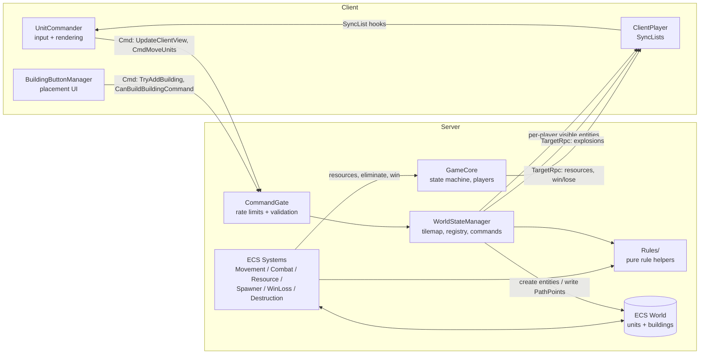
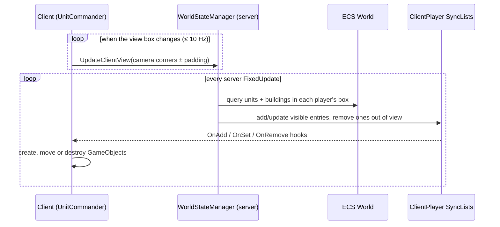
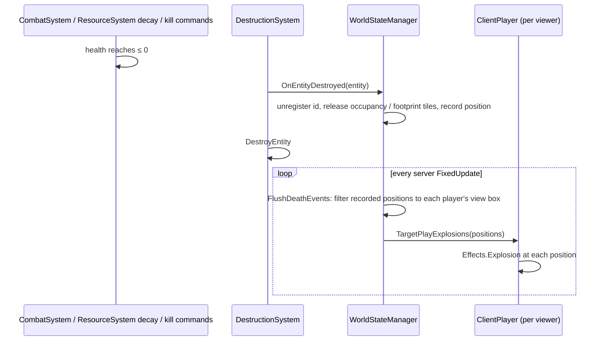
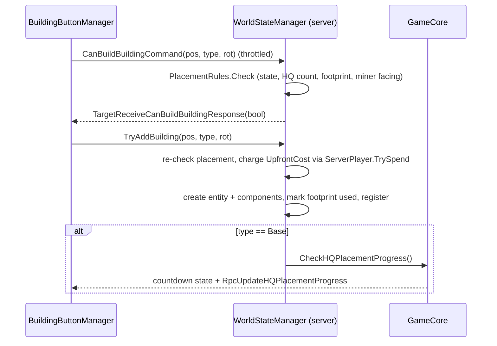

# Architecture

WAR-2D combines two models:

- **Mirror** handles connections, players, scene changes and all client↔server messaging.
- **Unity DOTS (Entities)** holds and simulates the game world. Units and buildings are ECS entities that exist **only on the server**.

Clients never see the ECS world directly. The server copies the entities inside each player's camera view into that player's `SyncList`s, and the client draws plain GameObjects from those lists.



## Assemblies

| Assembly | Where | Contents |
|---|---|---|
| `WAR2D` | `Assets/Scripts/WAR2D.asmdef` | All game code. References Mirror, Entities, Burst, Collections, Mathematics, Transforms, TextMeshPro, UnityEngine.UI, Input System, 2D Tilemap Extras, NaughtyAttributes and TIM Console; DOTween as a precompiled reference. |
| `WAR2D.Tests.EditMode` | `Assets/Tests/EditMode/` | Editor-only rule, parser and validation tests. |
| `WAR2D.Tests.PlayMode` | `Assets/Tests/PlayMode/` | Hosted-match tests that run in play mode. |
| Vendored | `Assets/Mirror/`, `Assets/3rd Party/`, `Assets/Plugins/` | Mirror, TIM Console, NaughtyAttributes, DOTween. |

Game code moved into its own assembly in v0.2, which is what lets the test assemblies reference it.

## Scenes and lifetime

| Scene | Contains | Notes |
|---|---|---|
| `Assets/Main_Menu.unity` | `GameManager` (Mirror `NetworkManager` + `KcpTransport`, port 7778), `GameCore`, `LobbySystem`, `MainMenuUI`, TIM Console + `Custom_Commands` | Offline scene. `GameManager` and `GameCore` are `DontDestroyOnLoad` singletons. |
| `Assets/Maps/Map_2.unity` | `WorldStateManager`, `UnitCommander`, `BuildingButtonManager`, `HQPlacementUI`, `ResourceUI`, orthographic camera with `Character_Controler`, walkable and unwalkable tilemaps | Loaded by `GameCore.Cmd_StartGame` → `ServerChangeScene`, using the scene name from `GameConfig.xml` (`Match.Scene`, currently `Map_2`). |
| `Assets/Player.prefab` | `ClientPlayer` | Mirror player prefab, auto-created for each connection and `DontDestroyOnLoad`. |

`GameManager.LeaveLobby()` stops the host or client, destroys the `GameCore` and `WorldStateManager` objects, and reloads `Main_Menu`.

## Core classes

### `GameManager` (`Scripts/GameManager.cs`): `NetworkManager`
- Loads `GameConfig.xml` in `Awake` and again in `OnStartServer`; an invalid config stops the server (and quits, in batch mode).
- **`OnServerAddPlayer`** creates a `ServerPlayer` with the configured starting resources and adds it to `GameCore.ServerPlayers`.
- **`OnServerDisconnect`** forwards to `GameCore.OnPlayerLeave`.
- Main-menu buttons are wired by **serialized references** in `MainMenuUI` (v0.2 removed the old tag-based lookups).
- Public actions: `HostServer`, `ConnectToServer(address)`, `LeaveLobby`, `QuitGame`.

### `GameCore` (`Scripts/GameCore.cs`): `NetworkBehaviour`, server game state
- `[SyncVar] CurrentState : GameState` (`Lobby`, `PlacingHQ`, `Countdown`, `Playing`, `GameOver`) and `[SyncVar] CountdownEndTime`.
- `ServerPlayers : Dictionary<NetworkIdentity, ServerPlayer>` is the authoritative player list. `MatchStartPlayerCount` records how many players were present when the match launched (so a departure before *Playing* can't stop the survivor from winning).
- Server ownership: `SetServerOwner`/`IsServerOwner`. The owner is the only player allowed to start a match, and ownership transfers when the owner leaves.
- `Cmd_StartGame` (owner only, *Lobby* only, valid config only) resets each player's `hasPlacedHQ`, captures `MatchStartPlayerCount`, switches to *PlacingHQ* and loads the configured map.
- `CheckHQPlacementProgress` starts the *Countdown* once every player has placed an HQ. `Update` switches to *Playing* at `CountdownEndTime`.
- `ApplyOutcome(MatchOutcome)` (from `WinLossSystem`) eliminates the newly HQ-less players and ends the match on a win or draw.
- `EliminatePlayer`, `DeclareWinner` and `DeclareDraw` send the Win/Lose/Draw TargetRpcs and wipe entities (through `WorldStateManager`).
- `OnPlayerLeave` removes the player, forgets their rate-limit buckets, drops their view and destroys their entities; it transfers ownership or, when the host leaves, shuts down with the server.
- Every `LateUpdate` it sends each player their resources via `TargetUpdateResources` **only when they changed**, at most every 0.1 s (`ResourcesDirty`).

### `ServerPlayer` (`Scripts/ServerPlayer.cs`)
- `ServerPlayer` is a plain C# object, server only: the connection, a `PlayerState` (`Playing`, `Eliminated`, `Spectating`), and `Resources` with a dirty flag. `Add` ignores non-positive amounts (including NaN); `TrySpend` goes through `UpkeepRules.TryCharge`.
- The client only learns a player's own resources, through the TargetRpc above — never a SyncVar.

### `ClientPlayer` (`Scripts/ClientPlayer.cs`): `NetworkBehaviour` on the player prefab
- `[SyncVar] nickname`, `hasPlacedHQ`, `isServerOwner` (drives the lobby Start button, including when ownership transfers).
- `SyncList<ClientUnit> visuableUnits`, `SyncList<BuildingData> visuableBuildings`, `SyncList<HealthComponent> entityHealth`. The server fills these with only what this player can see.
- `SetUnitHandles` / `SetBuildingHandles` connect the SyncList `OnAdd/OnInsert/OnSet/OnRemove/OnClear` callbacks to `UnitCommander`. `UnitCommander.Awake` calls them when `Map_2` loads.
- It receives these TargetRpcs: `TargetUpdateResources`, `TargetReceiveCanBuildBuildingResponse`, `TargetPlayExplosions`, `RpcOnPlayerWon`, `RpcOnPlayerLost` and `RpcOnMatchDraw` (the Lose screen relabelled "Draw"). The end screens load `Resources/UI/WinScreenUI` / `LoseScreenUI` and disable the HUD canvas.
- `CmdSetNickname` is the one authority-checked command here; it goes through `CommandGate` and `CommandValidator.TrySanitizeNickname`.

### `WorldStateManager` (`Scripts/Unit/WorldStateManager.cs`): `NetworkBehaviour`, the world gateway
- In `Awake` it builds a `TilemapStruct` (`NativeHashMap<int2, TileNode>`) from `WalkableTilemap` and `UnwalkableTilemap`. Unwalkable tiles whose tile asset name contains `"Gems"` become `TileType.Gem`; all others become `Wall`.
- Registries `Units` and `Buildings` (`Dictionary<int id, Entity>`), a `buildingFootprints` map so a destroyed building frees its tiles, `Occupancy` (`TileOccupancy`) for unit tile claims, and `Ids` (`NetIdAllocator`) for unique network ids.
- It owns every world **Command** clients send (see the table below), and runs `UpdatePlayerViews()` plus `FlushDeathEvents()` every server `FixedUpdate`.
- Building creation happens here (`TryAddBuilding`) with `EntityManager` and `ConfigLoader`; unit creation happens in `SpawnerSystem`.
- `OnEntityDestroyed` (called by `DestructionSystem`) unregisters the entity, releases its occupancy claims or footprint tiles, and records a death position. `KillAllEntitiesOwnedBy` zeros a player's entities' health so the normal destruction path (with explosions) runs; `DestroyAllEntities` wipes the world at match end.
- Debug: enable `showTileMapweights` to draw tile gizmos in play mode. Cyan = gem, red = wall, yellow = occupied, grey scale = weight.

### `UnitCommander` (`Scripts/Client/UnitCommander.cs`): client presentation and input
- Selection box (left drag) and move orders (right click → `CmdMoveUnits`).
- Sends its camera rectangle (padded by `visualAdditionalRange`) through `UpdateClientView`, but only when the rectangle changes and at most every 0.1 s — the same cadence as the server's rate limit.
- Creates and destroys a GameObject per visible unit or building (sprite loaded with `Resources.Load(<enum name>)`), tweens units toward their synced positions with DOTween, and draws attack tracers when `targetId`/`lastAttackTime` change. Target ids are network ids, so both the unit and building GameObject dictionaries are searched.
- Attaches `UnitDataClient` / `BuildingDataClient` (both `DataClient`) for health bars, and `SpawnerClientManager` to Small Unit Spawners for click-to-spawn.

### `BuildingButtonManager` (`Scripts/Building/Building Spawning/BuildingButtonManager.cs`)
- Maps HUD buttons to `BuildingType`s. While placing, it asks the server whether the spot is valid (change-gated and throttled `CanBuildBuildingCommand` → TargetRpc → preview colour) and places with `TryAddBuilding`.
- `HQPlacementUI` shows the HQ prompt and progress during *PlacingHQ*, and renders the server-owned countdown during *Countdown* from `GameCore.CountdownEndTime`.
- Lobby UI: `LobbySystem` builds one row per connected player, sends nickname edits on `onEndEdit`, and shows/hides the Start button from `ClientPlayer.isServerOwner`.

## ECS data model

All components are `IComponentData` structs, in `Scripts/Components/` (they used to live in `*Authoring` files; the authoring MonoBehaviours and the empty baking subscene were removed in v0.2).

| Component | File | Fields | On |
|---|---|---|---|
| `ClientUnit` | `Components/UnitComponents.cs` | `id`, `ownerId`, `position`, `spriteName : UnitType`, `targetId` (network id or −1), `lastAttackTime` | Units. Also the struct synced to clients. |
| `BuildingData` | `Components/BuildingComponents.cs` | `id`, `ownerId`, `position` (footprint anchor), `buildingType : BuildingType`, `rotation` (degrees) | Buildings. Also the struct synced to clients. |
| `HealthComponent` | `Components/UnitComponents.cs` | `entityId` (network id), `currentHealth`, `maxHealth` | Units, buildings |
| `DamageComponent` | `Components/UnitComponents.cs` | `damageAmount`, `range`, `attackSpeed` (seconds between attacks) | Units |
| `MovementComponent` | `Components/UnitComponents.cs` | `speed`, `acceleration`, `currentSpeed`, `blockedSeconds` (rotation fields are unused) | Units |
| `PathPoint` (buffer) | `Components/UnitComponents.cs` | `position : int2` | Units: the remaining waypoints |
| `UpkeepComponent` | `Components/UpkeepComponent.cs` | `ownerId`, `runningCostPerSecond`, `timeSinceLastCharge`, `unpaid` | Units, buildings |
| `MiningComponent` | `Building/MiningComponent.cs` | `timeSinceLastMining`, `isActive` | Miners |
| `SpawnerData` | `Components/BuildingComponents.cs` | `count` (queue), `ownerId`, `position`, `unitType`, `spawnRate`, `timeSinceLastSpawn` | Small Unit Spawners |
| `HQComponent` | `Components/HQComponent.cs` | `ownerId` | HQ (Base) |

Enums: `UnitType { None, Tank }`, `BuildingType { None, Miner, SmallUnitSpawner, Base }`, `TileType { Ground, Wall, Gem }`.

**IDs.** Units and buildings get ids from `NetIdAllocator` (1, 2, 3, … unique for the match, with a central exhaustion check). `ownerId` is the owning player's `netId` cast to `int` (`BuildingData.UIntToInt`). Both the registries and the client GameObject dictionaries are keyed by `id` — never `Entity.Index`.

## ECS systems (`Scripts/Systems/`)

All are `ISystem` structs in the default world. Every `OnUpdate` starts by checking `NetworkServer.active` (and usually `WorldStateManager.Instance`/`GameCore.Instance`), and the gameplay systems additionally require `GameState.Playing`.

| System | Runs | Does |
|---|---|---|
| `MovementSystem` | Every frame | Moves each unit toward `PathPoint[0]` with acceleration, claiming the target tile first (`TileOccupancy`) so two units never target the same tile. A unit blocked by another for 2 s clears its path. |
| `CombatSystem` | Every frame, *Playing* only | Keeps the current target if it's alive and in range, otherwise picks the nearest enemy-owned entity with health. Applies `damageAmount` every `attackSpeed` seconds and stores the target's **network id** in `ClientUnit.targetId`. Destruction is left to `DestructionSystem`. |
| `DestructionSystem` | Every frame | Destroys every entity at ≤ 0 health, calling `WorldStateManager.OnEntityDestroyed` first (unregister, free tiles, record death position). |
| `ResourceSystem` | Every frame, *Playing* only | Passive income for players still `Playing` (every 0.1 s), mining (every 1 s, only when the miner faces a gem), and upkeep for units and buildings (every 1 s). Unpaid entities decay by `DecayPercentPerSecond` of max health per second. |
| `SpawnerSystem` | Every frame, *Playing* only | For each spawner with `count > 0` and enough time elapsed for `SpawnRate`, charges the unit's upfront cost and creates a unit on a nearby free tile. Leaves the queue unchanged when no tile is free, and restores the count when the owner can't afford the unit. |
| `WinLossSystem` | Every 1 s, *Playing* only | Counts players that own an HQ with health > 0 and applies `WinLossRules.Evaluate` through `GameCore.ApplyOutcome`. |

## Rule and net helpers

Pure, testable classes that the systems and commands share (most of the EditMode tests target these directly):

- **`Scripts/Rules/`** — `PlacementRules` (game state, one-HQ-per-player, footprint free, Miner faces gem), `MinerRules` (facing offset, Z rotation), `Footprint` (anchor ↔ covered tiles ↔ visual centre), `CombatRules` (nearest enemy, attack cadence), `MovementMath` (non-overshooting step, arrive distance, blocked give-up), `SpawnerRules` (queue cap 100, spawn cadence), `UpkeepRules` (charge and decay maths), `WinLossRules` (elimination/winner/draw evaluation), `TileSearch` (bounded BFS for free tiles), `VisibilityRules` (view-box filtering).
- **`Scripts/Net/`** — `CommandGate` (see below), `RateLimiter` (per-connection/per-command token buckets), `CommandValidator` (box span ≤ 256, nickname sanitising ≤ 24 chars), `TileOccupancy` (which unit claims which tile), `NetIdAllocator` (unique ids).

## Networking reference

### Client → server (Mirror `[Command]`)

| Command | On | Purpose | Gate + validation |
|---|---|---|---|
| `CmdSetNickname(name)` | `ClientPlayer` | Rename in the lobby | `CommandGate`; nickname sanitised; *Lobby* only |
| `Cmd_StartGame()` | `GameCore` | Server owner starts the match | `CommandGate`; ownership, state and config checked |
| `UpdateClientView(start, end)` | `WorldStateManager` | Camera rectangle for visibility (change-gated, ≤ 10 Hz) | `CommandGate`; box span validated |
| `CmdMoveUnits(goal, start, end)` | `WorldStateManager` | Move the sender's units inside the box | `CommandGate`; box validated; *Playing* only; per-unit ownership |
| `TryAddBuilding(pos, type, rot)` | `WorldStateManager` | Validate, charge and create a building | `CommandGate`; `PlacementRules`; cost charged |
| `CanBuildBuildingCommand(pos, type, rot)` | `WorldStateManager` | Placement preview validity | `CommandGate`; throttled client-side |
| `BuildingClicked(id)` | `WorldStateManager` | Queue a unit at an owned spawner | `CommandGate`; *Playing* only; ownership checked |

All are `requiresAuthority = false` and take `NetworkConnectionToClient sender = null`, because the player's own object isn't the sender of these world commands.

### Server → client

| Mechanism | Member | Purpose |
|---|---|---|
| SyncVar | `GameCore.CurrentState`, `GameCore.CountdownEndTime`, `ClientPlayer.nickname`, `ClientPlayer.hasPlacedHQ`, `ClientPlayer.isServerOwner` | Shared state |
| SyncList | `ClientPlayer.visuableUnits / visuableBuildings / entityHealth` | Per-player visible world |
| TargetRpc | `TargetUpdateResources` | Private resources, sent only when changed (≤ 10 Hz) |
| TargetRpc | `TargetReceiveCanBuildBuildingResponse` | Placement preview replies |
| TargetRpc | `TargetPlayExplosions` | Death explosions inside that player's view (≤ 256 per message) |
| TargetRpc | `RpcOnPlayerWon`, `RpcOnPlayerLost`, `RpcOnMatchDraw` | End-of-game screens |
| ClientRpc | `RPC_RemoveClientLobbyUI`, `RpcUpdateHQPlacementProgress` | Lobby cleanup, progress |

### Command security

Every client `[Command]` calls `CommandGate.Allow(sender, nameof(...))` first and returns if it fails. The gate is a per-connection, per-command token bucket (`Net/RateLimiter.cs`); a connection that exceeds a command's budget 200 times inside 10 s is disconnected. Buckets are forgotten when the player leaves. Anything else the command depends on — ownership, game state, argument shape — is validated server-side inside the handler with `CommandValidator` and the `Rules/` classes; the client is never trusted.

## Visibility (fog of war by camera)



Players see **every** entity inside their camera rectangle, their own and their enemies' alike. There is no line-of-sight or unit-vision radius (fog of war arrives in v0.5). `UpdatePlayerViews` rebuilds each player's lists with LINQ `Any`/`FindIndex` lookups, which is O(players × visible²) — a known, v0.5-targeted cost.

## Destruction and death events



Every path to death goes through the same pipeline: combat damage, unpaid-upkeep decay and player elimination all set health to ≤ 0, and the match-end wipe records positions as it destroys — so every death reaches clients as an explosion, and only if that client can see the tile.

## Building placement



Anchors: `Footprint` treats the anchor as the tile at `size/2` from the footprint's bottom-left, so the sprite pivot is the footprint centre. Buildings can't be placed on tiles claimed by a unit, and a Miner must face a gem tile.

## Pathfinding (`Scripts/Unit/Pathfinding/`)

- 8-directional A* over `TilemapStruct`, Burst-compiled (`Pathfinding.FindPath` → `BurstFindPath`) with an octile heuristic. Walls and used tiles are impassable; the search is bounded by `width × height` expansions.
- `WorldStateManager.MoveUnit` calls it synchronously and writes the result into the unit's `PathPoint` buffer.
- `FindBestGoalLocation` runs a bounded BFS out from the clicked tile so each unit in a group gets a different free goal; `TryFindFreeTileNear` does the same to find a spawn tile outside a spawner. Spawn tiles are claimed immediately so two spawns can't pick the same tile.
- The old managed fallback path and its `doJob` branch were deleted in v0.2; `NativePriorityQueue` remains the queue used by the Burst path.

## Configuration

`Assets/Resources/GameConfig.xml` is the **single** source of gameplay balance values. `Config.ConfigParser` parses it strictly and culture-invariantly; every problem (missing section, missing enum type, non-number, out-of-range value) is collected into `ConfigLoader.Errors` and logged with a `[GameConfig]` prefix. `ConfigLoader.LoadConfig()` caches the result and `ConfigLoader.IsValid` tells callers whether it is safe to host; `GameManager` refuses to start a server with an invalid config, and `Cmd_StartGame` checks it again.

Schema:

```xml
<GameConfig>
  <Resources>
    <PassiveGenerationRate/> <StartingResources/> <MiningRate/>
    <DecayPercentPerSecond/> <!-- % of max health lost per second while upkeep is unpaid -->
  </Resources>
  <Match>
    <Scene/>            <!-- scene loaded when the match starts -->
    <CountdownSeconds/> <!-- one server-owned countdown, synced to all clients -->
    <Map>
      <Size/>      <!-- 0 = the scene's tilemaps, else 128..4096 tiles per side, generated -->
      <Seed/>      <!-- 0 = random per match -->
      <GemChance/> <!-- share of floor-facing rock that becomes gem -->
    </Map>
  </Match>
  <Simulation>  <!-- server tick: TickRate, TargetSearchSliceTicks, SeparationIntervalTicks,
                     SeparationStrength, HashCellSize, MaxFieldRebuildsPerTick,
                     MaxUnitsPerPlayer, MaxEntities -->
  </Simulation>
  <Replication> <!-- encoder: CorrectionIntervalTicks, CorrectionThreshold, DeltaScale,
                     OffscreenThreshold, OffscreenIntervalTicks, SnapshotBytesPerSecond -->
  </Replication>
  <DamageTable>
    <Entry attacker="Tank" target="Wall">0.5</Entry> <!-- target: Unit | Building | Wall; 1.0 when missing -->
  </DamageTable>
  <Units>
    <Unit type="Tank"> <!-- must match a UnitType enum name; every non-None type is required -->
      <Health/> <Damage/> <Range/> <AttackInterval/> <MoveSpeed/>
      <Acceleration/> <UpfrontCost/> <RunningCost/>
      <Radius/> <SizeClass/> <!-- collision radius in tiles; pathing class 0 small, 1 large -->
    </Unit>
  </Units>
  <Buildings>
    <Building type="Base"> <!-- must match a BuildingType enum name; every non-None type is required -->
      <Health/> <Width/> <Height/> <UpfrontCost/> <RunningCost/> <SpawnRate/>
    </Building>
  </Buildings>
</GameConfig>
```

`Width`/`Height` set a building's footprint (and the client uses the same `Footprint` maths to place its sprite). `SpawnRate` is units per second and must be > 0 for the Small Unit Spawner.

## Rendering and input

- **URP 2D.** `Assets/Settings/Rendering/URP-2D.asset` is the default render pipeline in `ProjectSettings/GraphicsSettings.asset`, with `Renderer2D.asset` and a Global Light 2D in both scenes. (A dangling HDRP entry and an inert `HDRPProjectSettings.asset` remain; see [known-issues.md](known-issues.md).)
- **Input System only** (`activeInputHandler: 1`). Gameplay input is a code-defined action map in `Scripts/Client/GameInput.cs` (`Pan`, `Zoom`, `FastPan`, `Select`, `Command`, `Rotate`, `Point`, plus `PointerOverUI`); UI uses `InputSystemUIInputModule`. No game code uses the legacy `Input` API.
- **Orthographic camera.** `Character_Controler` pans at a speed scaled by `orthographicSize / 5`, zooms the orthographic size between 3 and 30, and uses `GameInput` throughout.
- Client-side placeholder effects (`Effects.Explosion`, `Effects.Tracer`) draw procedural sprites from `ProceduralSprites`; real art is scheduled for v0.8.

## Asset naming conventions

Sprites are loaded by enum name from the root of `Resources/`, e.g. `Resources.Load<Sprite>("Tank")`, `"Miner"`, `"SmallUnitSpawner"`, `"Base"`. So a new `UnitType` or `BuildingType` needs a sprite with exactly that name directly in `Assets/Resources/`. A building's footprint now comes from `Width`/`Height` in config (the client positions it with `Footprint.VisualCenter`), not from sprite size.

## Tests

- `WAR2D.Tests.EditMode` covers the pure rules, config parser, validators, rate limiter, tile occupancy, ids, pathfinding and the input map.
- `WAR2D.Tests.PlayMode` hosts real matches in play mode (HQ placement, spawner output, draws).
- Run them through the open Unity editor: `tools/unity-test.sh EditMode` and `tools/unity-test.sh PlayMode`. `tools/unity-compile.sh` checks compilation first. There is no CI.

## Developer tools

- **TIM Console** (`` ` `` to toggle). Custom commands live in `Assets/3rd Party/Console/Custom Commands/Custom_Commands.cs`: help, server player count, server/client active, GameCore null check, players' resources, WorldStateManager.
- **NaughtyAttributes** `[Button]`s on `UnitDataClient` / `BuildingDataClient` print a clicked object's synced data in the inspector.
