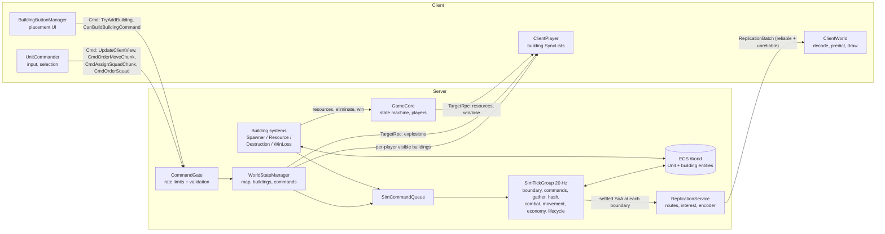
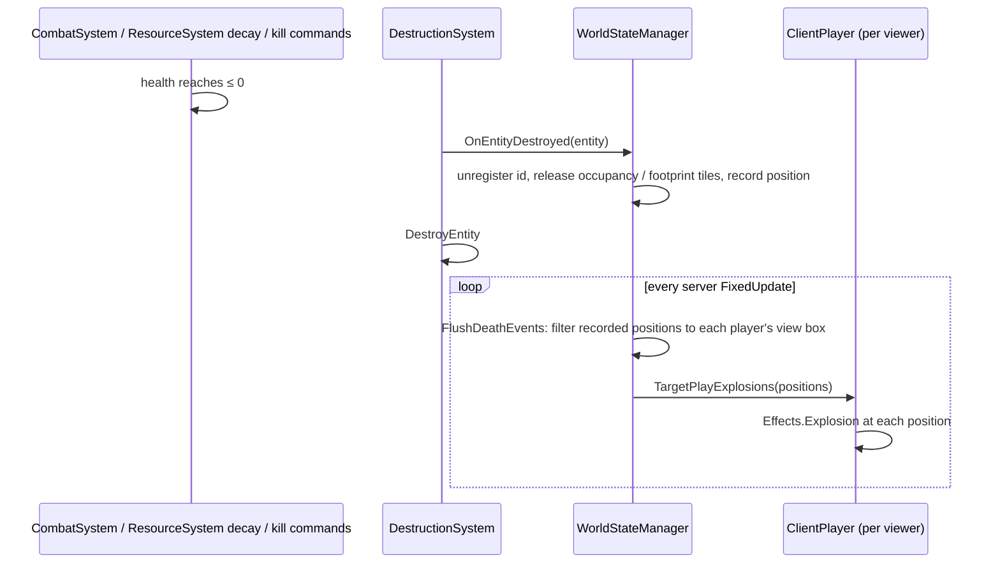
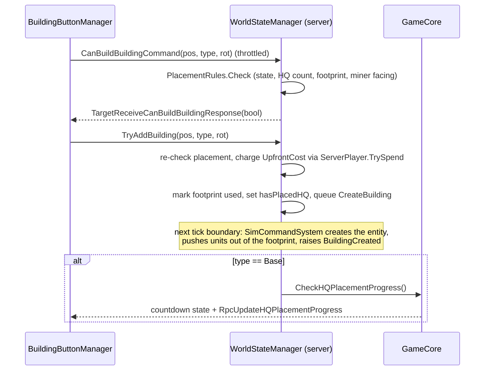

# Architecture

WAR-2D combines two models:

- **Mirror** handles connections, players, scene changes and all client↔server messaging.
- **Unity DOTS (Entities)** holds and simulates the game world. Units and buildings are ECS entities that exist **only on the server**.

Clients never see the ECS world. Units reach them through the **replication encoder**: each client gets its own units and the units inside its camera box as routes plus corrections, and predicts and draws them with GPU instancing. Buildings (a few hundred at most) still reach clients through `ClientPlayer` SyncLists and are drawn as GameObjects.

The server simulates units in an **asynchronous 20 Hz tick**: a fixed-rate system group whose Burst jobs run on worker threads between ticks and are settled at the next tick boundary. Main-thread code never touches unit entities; it queues `SimCommand`s that the tick applies at its boundary.



## Assemblies

| Assembly | Where | Contents |
|---|---|---|
| `WAR2D` | `Assets/Scripts/WAR2D.asmdef` | All game code. References Mirror, Entities, Burst, Collections, Mathematics, Transforms, TextMeshPro, UnityEngine.UI, Input System, 2D Tilemap Extras, NaughtyAttributes and TIM Console; DOTween as a precompiled reference. |
| `WAR2D.Tests.EditMode` | `Assets/Tests/EditMode/` | Editor-only rule, parser, validation, simulation (`SimHarness`), flow-field and replication tests. |
| `WAR2D.Tests.PlayMode` | `Assets/Tests/PlayMode/` | Hosted-match tests that run in play mode, plus the performance regression guard (Unity Performance Testing). |
| Vendored | `Assets/Mirror/`, `Assets/3rd Party/`, `Assets/Plugins/` | Mirror, TIM Console, NaughtyAttributes, DOTween. |

Game code moved into its own assembly in v0.2, which is what lets the test assemblies reference it.

## Scenes and lifetime

| Scene | Contains | Notes |
|---|---|---|
| `Assets/Main_Menu.unity` | `GameManager` (Mirror `NetworkManager` + `KcpTransport`, port 7778), `GameCore`, `LobbySystem`, `MainMenuUI`, TIM Console + `Custom_Commands` | Offline scene. `GameManager` and `GameCore` are `DontDestroyOnLoad` singletons. |
| `Assets/Maps/Map_2.unity` | `WorldStateManager`, `UnitCommander` (adds `ClientWorld` on clients), `BuildingButtonManager`, `HQPlacementUI`, `ResourceUI`, orthographic camera with `Character_Controler`, walkable and unwalkable tilemaps | Loaded by `GameCore.Cmd_StartGame` → `ServerChangeScene`, using the scene name from `GameConfig.xml` (`Match.Scene`, currently `Map_2`). With `Match/Map/Size > 0` (the default, 1024) the map is generated and the scene's tilemaps are hidden; with 0 the tilemaps are the map (the PlayMode tests use this). |
| `Assets/Player.prefab` | `ClientPlayer` | Mirror player prefab, auto-created for each connection and `DontDestroyOnLoad`. |

`GameManager.LeaveLobby()` stops the host or client, destroys the `GameCore` and `WorldStateManager` objects, and reloads `Main_Menu`.

## Core classes

### `GameManager` (`Scripts/GameManager.cs`): `NetworkManager`
- Loads `GameConfig.xml` in `Awake` and again in `OnStartServer`; an invalid config stops the server (and quits, in batch mode).
- **`OnServerAddPlayer`** creates a `ServerPlayer` with the configured starting resources and adds it to `GameCore.ServerPlayers`.
- **`OnServerDisconnect`** stops replication to the connection and forwards to `GameCore.OnPlayerLeave`.
- **`OnStartClient`** registers the `ReplicationBatch` handler, which forwards to `ReplicationClient.Received`.
- Main-menu buttons are wired by **serialized references** in `MainMenuUI` (v0.2 removed the old tag-based lookups).
- Public actions: `HostServer`, `ConnectToServer(address)`, `LeaveLobby`, `QuitGame`.

### `GameCore` (`Scripts/GameCore.cs`): `NetworkBehaviour`, server game state
- `[SyncVar] CurrentState : GameState` (`Lobby`, `PlacingHQ`, `Countdown`, `Playing`, `GameOver`) and `[SyncVar] CountdownEndTime`.
- `ServerPlayers : Dictionary<NetworkIdentity, ServerPlayer>` is the authoritative player list. `MatchStartPlayerCount` records how many players were present when the match launched (so a departure before *Playing* can't stop the survivor from winning).
- `PlayerOrder : SyncList<int>` holds the owner ids in match order; a client colours an owner's units by its position here.
- `Bots` are connectionless players for the performance harness only (`AddBot`, refused unless `DevApi.Allowed`). They count in the player order, the match's player count and win/loss.
- Server ownership: `SetServerOwner`/`IsServerOwner`. The owner is the only player allowed to start a match, and ownership transfers when the owner leaves.
- `Cmd_StartGame` (owner only, *Lobby* only, valid config only) resets each player's `hasPlacedHQ`, captures `MatchStartPlayerCount`, switches to *PlacingHQ* and loads the configured map.
- `CheckHQPlacementProgress` starts the *Countdown* once every player has placed an HQ. `Update` switches to *Playing* at `CountdownEndTime`.
- `ApplyOutcome(MatchOutcome)` (from `WinLossSystem`) eliminates the newly HQ-less players and ends the match on a win or draw.
- `EliminatePlayer`, `DeclareWinner` and `DeclareDraw` send the Win/Lose/Draw TargetRpcs and wipe entities (through `WorldStateManager`).
- `OnPlayerLeave` removes the player, forgets their rate-limit buckets, drops their view and destroys their entities; it transfers ownership or, when the host leaves, shuts down with the server.
- Every `LateUpdate` it sends each player their resources via `TargetUpdateResources` **only when they changed**, at most every 0.1 s (`ResourcesDirty`).

### `ServerPlayer` (`Scripts/ServerPlayer.cs`)
- `ServerPlayer` is a plain C# object, server only: the connection, a `PlayerState` (`Playing`, `Eliminated`, `Spectating`), and `Resources` with a dirty flag. `Add` ignores non-positive amounts (including NaN); `TrySpend` goes through `UpkeepRules.TryCharge`.
- The client only learns a player's own resources, through the TargetRpc above — never a SyncVar.

### `ClientPlayer` (`Scripts/ClientPlayer.cs`): `NetworkBehaviour` on the player prefab
- `[SyncVar] nickname`, `hasPlacedHQ`, `isServerOwner` (drives the lobby Start button, including when ownership transfers).
- `SyncList<BuildingData> visuableBuildings` and `SyncList<HealthComponent> entityHealth` (buildings only; units go through replication). The server fills these with only the buildings this player can see.
- `SetBuildingHandles` connects the SyncList callbacks to `UnitCommander`, which calls it when `Map_2` loads.
- It receives these TargetRpcs: `TargetUpdateResources`, `TargetReceiveCanBuildBuildingResponse`, `TargetPlayExplosions`, `RpcOnPlayerWon`, `RpcOnPlayerLost` and `RpcOnMatchDraw` (the Lose screen relabelled "Draw"). The end screens load `Resources/UI/WinScreenUI` / `LoseScreenUI` and disable the HUD canvas.
- `CmdSetNickname` is the one authority-checked command here; it goes through `CommandGate` and `CommandValidator.TrySanitizeNickname`.

### `WorldStateManager` (`Scripts/Unit/WorldStateManager.cs`): `NetworkBehaviour`, the world gateway
- In `OnStartServer` it builds `Map` (a `MapStore`, see "Map" below), then creates the match's simulation (`Sim`, a `SimContext`) and unit replication (`Replication`, a `ReplicationService`), and registers every connected player with replication. `OnDestroy` disposes all three.
- `Ids => Sim.Ids` (the match's `NetIdAllocator`), a `Buildings` registry (`Dictionary<int id, Entity>`) and a `buildingFootprints` map so a destroyed building frees its tiles.
- It owns every world **Command** clients send (see the table below), and runs `UpdatePlayerViews()` (buildings only) plus `FlushDeathEvents()` every server `FixedUpdate`. The order and squad commands live in `Net/OrderCommands.cs` (`WorldStateManager` is `partial`).
- `TryAddBuilding` validates, charges, reserves the footprint and sets `hasPlacedHQ`, then queues `CreateBuilding`; the entity appears at the next tick boundary. Spawners queue `SpawnUnit`.
- `OnEntityDestroyed` (called by `DestructionSystem`) unregisters a building, frees its id and footprint, and records a death position; unit deaths arrive through `SimContext.UnitDied`. `KillAllEntitiesOwnedBy` zeros the player's buildings' health and queues `KillOwner` (and forgets their squads); `DestroyAllEntities` wipes buildings and queues `DestroyAll` at match end.
- Dev only (`DevApi.Allowed`): `DevPlaceBuilding` and `DevSpawnUnit` for the performance harness.

## Map (`Scripts/World/`)

- `MapGrid` is the tile grid: `Width`, `Height`, `Tiles` (`(byte)TileType` per tile: Ground 0, Wall 1, Gem 2, Border 3) and `Used` (1 under a building footprint), row-major with tile (x, y) covering [x, x+1). Off-map reads as `Border`. **Grid tiles are world tiles**, so the map starts at (0, 0) and `WorldStateManager.MapBounds` is `(0, size − 1)`.
- `MapStore` owns the grid's native memory. `Generate(size, seed, gemChance)` runs `MapGenerator` (the v0.3 cave generator: 45 % rock smoothed four times, eight HQ clearings on a circle joined to the centre by corridors, unreachable floor filled in, gems on floor-facing rock, a guaranteed gem vein beside each clearing, a border ring). `FromTilemaps` reads Map_2's tilemaps through `CellToWorld`; Map_2's Ground and Walls tilemaps are offset by (29, 45) so every tile is non-negative. `SetUsed` records footprint changes in `ChangedTiles`, and `Hash()` is FNV-1a over the tile kinds.
- Generated maps reach clients as three SyncVars on `WorldStateManager`: `MapSize`, `MapSeed`, `MapHash`. A client regenerates the map, disconnects on a hash mismatch (`[Map] hash mismatch`), hides the tilemap renderers and draws the map with `MapView`: one point-filtered texture, one texel per tile, on a quad at z = 1. A 1024² map generates in about 170 ms.

### `UnitCommander` (`Scripts/Client/UnitCommander.cs`): client presentation and input
- Owns the local `Selection` (`Client/Selection.cs`): left drag selects every own unit in the box (no limit; Shift adds), right click orders the selection, Ctrl+1–0 assigns a squad and 1–0 selects one. Orders go out as chunked id lists, or as one `CmdOrderSquad` when the selection is exactly a squad.
- Sends its camera rectangle (padded by `visualAdditionalRange`, clamped to the map) through `UpdateClientView`, only when it changes and at most every 0.1 s.
- Adds `ClientWorld` on clients and calls `ClientWorld.Draw(selection)` from `LateUpdate`.
- Buildings: creates a GameObject per visible building from the SyncList hooks (sprite loaded by enum name), with `BuildingDataClient` for health and `SpawnerClientManager` on Small Unit Spawners for click-to-spawn.

### `ClientWorld` (`Scripts/Client/ClientWorld.cs`): the client's units
- Wraps a `ClientUnitStore`, which decodes `ReplicationBatch` payloads (Enter, Leave, MoveOrder, Correction, Health, Attack) and predicts every known unit with `MovementPrediction`, the same code the server's encoder runs, so the server knows the client's position bit for bit. A malformed batch is logged and dropped.
- `ServerTime` advances with real time and is nudged (≤ 10 % a frame, never backward) toward the newest batch's tick plus the time since it arrived; a quiet server sends no batches, but its clock keeps running.
- Every frame a Burst job predicts all known units; `Draw` packs them into `UnitInstance`s (position, facing from motion, owner colour from `GameCore.PlayerOrder`, selection highlight) and draws them with `InstancedUnitRenderer`: one `Graphics.RenderPrimitives` call for units and one for the damaged units' health bars (`Resources/Shaders/InstancedUnit.shader`).
- `Attack` events become tracers for attackers on screen (≤ 200 a frame).
- `TryGet`, `IsKnownId` and `QueryBox` serve selection.

### `BuildingButtonManager` (`Scripts/Building/Building Spawning/BuildingButtonManager.cs`)
- Maps HUD buttons to `BuildingType`s. While placing, it asks the server whether the spot is valid (change-gated and throttled `CanBuildBuildingCommand` → TargetRpc → preview colour) and places with `TryAddBuilding`.
- `HQPlacementUI` shows the HQ prompt and progress during *PlacingHQ*, and renders the server-owned countdown during *Countdown* from `GameCore.CountdownEndTime`.
- Lobby UI: `LobbySystem` builds one row per connected player, sends nickname edits on `onEndEdit`, and shows/hides the Start button from `ClientPlayer.isServerOwner`.

## ECS data model

All components are `IComponentData` structs.

| Component | File | Fields | On |
|---|---|---|---|
| `Unit` | `Sim/SimComponents.cs` | `Id`, `OwnerId`, `OwnerSlot`, `Type`, `SizeClass`, `TargetKind`, `Radius`, `Health`, `MaxHealth`, `Position`, `Velocity`, `TargetId` (unit or building id, or −1), `Cooldown`, `OrderSlot` (order handle or −1), `Unpaid` | Units: the only unit component |
| `SimData` (singleton) | `Sim/SimData.cs` | The map arrays (not owned), per-type balance tables, the damage table, and the SoA scratch every stage runs over (positions, health, owners, ids, hash cells, targets…), building targets, attack events, death queue, pending orders/moves, order table, economy arrays | The sim singleton |
| `SimClock` (singleton) | `Sim/SimComponents.cs` | `Tick`, `Running`, `Dt`, `UnitCount` | The sim singleton |
| `MapGrid` | `World/MapGrid.cs` | `Width`, `Height`, `Tiles`, `Used` | A plain struct the sim and pathing copy |
| `BuildingData` | `Components/BuildingComponents.cs` | `id`, `ownerId`, `position` (footprint anchor), `buildingType`, `rotation` (degrees) | Buildings. Also the struct synced to clients. |
| `HealthComponent` | `Components/UnitComponents.cs` | `entityId`, `currentHealth`, `maxHealth` | Buildings |
| `UpkeepComponent` | `Components/UpkeepComponent.cs` | `ownerId`, `runningCostPerSecond`, `timeSinceLastCharge`, `unpaid` | Buildings |
| `MiningComponent` | `Building/MiningComponent.cs` | `timeSinceLastMining`, `isActive` | Miners |
| `SpawnerData` | `Components/BuildingComponents.cs` | `count` (queue), `ownerId`, `position`, `unitType`, `spawnRate`, `timeSinceLastSpawn` | Small Unit Spawners |
| `HQComponent` | `Components/HQComponent.cs` | `ownerId` | HQ (Base) |

Enums: `UnitType { None, Tank }`, `BuildingType { None, Miner, SmallUnitSpawner, Base }`, `TileType { Ground, Wall, Gem, Border }`, `TargetClass { Unit, Building, Wall }`.

**IDs.** Units and buildings share one `NetIdAllocator` per match: an id is `(generation << 20) | index`. The index (below `MaxEntities`) addresses every per-unit array, and the generation (1..2047, wrapping) changes when an index is reused, so a stale id never matches a newer entity. `ownerId` is the owning player's `netId` cast to `int` (`BuildingData.UIntToInt`). Nothing is keyed by `Entity.Index`.

## The simulation tick (`Scripts/Sim/`)

`SimTickGroup` (in `SimulationSystemGroup`) runs at `Simulation/TickRate` (20 Hz) through a `FixedRateCatchUpManager`. `SimContext` (created by `WorldStateManager.OnStartServer`) owns the singletons, the id allocator, the `SimCommandQueue`, the `OrderBook` and the owner slots; the systems do nothing until it exists. Stages in order:

| System | Does |
|---|---|
| `SimBoundarySystem` (first, managed) | `CompleteAllTrackedJobs` (the previous tick's jobs) → destroys the units the lifecycle queued (freeing ids, raising `UnitDied` for explosions) → takes last second's upkeep from the owners (`SimContext.Spend`) and refreshes budgets (`BudgetOf`) → `OrderBook.AtBoundary` (publish rebuilt flow fields, apply terrain changes, retire orders with no followers, extend routes to sectors units wandered into) → raises `Settled` (replication runs here on the settled SoA) → sets `Running` (server, *Playing*). Later stages return at once while not running. |
| `SimCommandSystem` (managed) | Writes last tick's building damage to `HealthComponent`s, then drains the queue: `CreateBuilding` (and pushes units out of the new footprint), `KillOwner` and `DestroyAll` in any state; `SpawnUnit` (refused over `MaxUnitsPerPlayer`) and `MoveUnits` only while running (deferred otherwise). Every structural change to units happens here. |
| `SimGatherSystem` | Counts units and gathers building targets on the main thread, then a parallel job copies each `Unit` into its SoA slot, applying pending orders and moves. |
| `SimHashSystem` | Counting-sort spatial hashes of units and buildings (`HashCellSize` 5). |
| `SimCombatSystem` | Resolves last tick's targets, runs the sliced nearest-enemy search (a unit searches every `TargetSearchSliceTicks` ticks; enemy units first, then enemy buildings), attacks on cooldown for `Damage × DamageTable(type, target class)`, applies damage with one writer, records attack events, writes back. |
| `SimMovementSystem` | Follows the order's flow field from the `OrderFieldTable` (aiming at the next cell's centre), holds while it has a target, steers straight at the goal and reports a route miss when off the route, separates (every `SeparationIntervalTicks`), integrates without entering blocked tiles, counts each order's followers. A unit stops within `0.5 + 0.4·√followers` tiles of the goal. |
| `SimEconomySystem` | Once a second charges each owner's units their running cost in slot order until the owner's budget runs out (the rest are unpaid); unpaid units decay; counts units per owner. |
| `SimLifecycleSystem` | Queues every unit at 0 health for the next boundary. |
| `SimEndSystem` (last) | Schedules up to `MaxFieldRebuildsPerTick` flow-field rebuilds (completed at the next boundary) and closes the main-thread timing (`SimTiming`). |

Every stage declares write access to `Unit`, which chains their jobs without a sync point; no stage completes its own jobs.

## Building systems (`Scripts/Systems/`)

`ISystem` structs in the default world, server only, on building components (no tick job touches them):

| System | Runs | Does |
|---|---|---|
| `SpawnerSystem` | Every frame, *Playing* only | Spawner timing and cost; queues `SpawnUnit` on the nearest free walkable tile outside the footprint. A refused spawn (unit cap) is refunded and the queue kept. |
| `ResourceSystem` | Every frame, *Playing* only | Passive income, mining (every 1 s, only when the miner faces a gem), and building upkeep and decay. |
| `DestructionSystem` | Every frame | Destroys buildings at ≤ 0 health, calling `WorldStateManager.OnEntityDestroyed` first. |
| `WinLossSystem` | Every 1 s, *Playing* only | Applies `WinLossRules.Evaluate` to the players (and bots) that own a living HQ. |

## Rule and net helpers

- **`Scripts/Rules/`** — `PlacementRules`, `MinerRules`, `Footprint`, `DamageTable` (Burst-friendly multipliers), `SpawnerRules`, `UpkeepRules`, `WinLossRules`, `TileSearch`, `VisibilityRules`.
- **`Scripts/Net/`** — `CommandGate`, `RateLimiter`, `CommandValidator` (box span, nickname, squad index, bounds), `NetIdAllocator`, `OrderIdCodec` (chunked delta-varint id lists), `OrderCommands.cs`, and `Replication/` (below).

## Networking reference

### Client → server (Mirror `[Command]`)

| Command | On | Purpose | Budget (burst, /s) | Validation |
|---|---|---|---|---|
| `CmdSetNickname(name)` | `ClientPlayer` | Rename in the lobby | 5, 1 | nickname sanitised; *Lobby* only |
| `Cmd_StartGame()` | `GameCore` | Server owner starts the match | 3, 0.5 | ownership, state and config |
| `UpdateClientView(start, end)` | `WorldStateManager` | Camera rectangle (interest box) | 20, 15 | box span; clamped to the map |
| `CmdOrderMoveChunk(token, ids, final, goal)` | `WorldStateManager` | One chunk of a move order | 40, 20 | *Playing*, player still playing; goal inside the map; `OrderIdCodec.TryDecode` (≤ 2,048 ids, ≤ 8 KB, strictly ascending); ≤ `MaxUnitsPerPlayer` ids per token; ≤ 4 open tokens, dropped after 2 s; the sim skips ids that aren't the sender's or aren't live |
| `CmdAssignSquadChunk(token, squad, ids, final)` | `WorldStateManager` | One chunk of a squad assignment | 40, 10 | as above, plus squad 0..9 |
| `CmdOrderSquad(squad, goal)` | `WorldStateManager` | Order a squad's living members | 10, 5 | squad 0..9; goal inside the map; dead members pruned |
| `TryAddBuilding(pos, type, rot)` | `WorldStateManager` | Validate, charge and queue a building | 10, 5 | `PlacementRules`; cost charged |
| `CanBuildBuildingCommand(pos, type, rot)` | `WorldStateManager` | Placement preview validity | 20, 15 | throttled client-side |
| `BuildingClicked(id)` | `WorldStateManager` | Queue a unit at an owned spawner | 20, 10 | *Playing* only; ownership |

All are `requiresAuthority = false` and take `NetworkConnectionToClient sender = null`.

### Server → client

| Mechanism | Member | Purpose |
|---|---|---|
| Message | `ReplicationBatch { Tick, Flags, Payload }` | Unit replication: whole encoded messages; reliable batches carry Enter/Leave/MoveOrder/Health, unreliable ones one Correction or Attack message each |
| SyncVar | `GameCore.CurrentState`, `GameCore.CountdownEndTime`, `ClientPlayer.nickname`, `hasPlacedHQ`, `isServerOwner`, `WorldStateManager.MapSize / MapSeed / MapHash` | Shared state |
| SyncList | `GameCore.PlayerOrder` | Owner order (unit colours) |
| SyncList | `ClientPlayer.visuableBuildings / entityHealth` | Per-player visible buildings |
| TargetRpc | `TargetUpdateResources` | Private resources, sent only when changed (≤ 10 Hz) |
| TargetRpc | `TargetReceiveCanBuildBuildingResponse` | Placement preview replies |
| TargetRpc | `TargetPlayExplosions` | Death explosions inside that player's view (≤ 256 per message) |
| TargetRpc | `RpcOnPlayerWon`, `RpcOnPlayerLost`, `RpcOnMatchDraw` | End-of-game screens |
| ClientRpc | `RPC_RemoveClientLobbyUI`, `RpcUpdateHQPlacementProgress` | Lobby cleanup, progress |

### Command security

Every client `[Command]` calls `CommandGate.Allow(sender, nameof(...))` first and returns if it fails. The gate is a per-connection, per-command token bucket (`Net/RateLimiter.cs`); a connection that exceeds a command's budget 200 times inside 10 s is disconnected. Buckets are forgotten when the player leaves. Anything else the command depends on — ownership, game state, argument shape — is validated server-side inside the handler with `CommandValidator` and the `Rules/` classes; the client is never trusted.

## Unit replication (`Scripts/Net/Replication/`)

```mermaid
sequenceDiagram
    participant T as SimBoundarySystem
    participant R as ReplicationService
    participant C as ClientWorld
    T->>R: Settled(SimData, tick, count)
    R->>R: RouteMaintenanceJob: trace new/changed orders' routes from the flow cells
    R->>R: BuildInterestJob per client: own units + units in the camera box, diffed by id index
    R->>R: EncodeClientJob per client: Leave, Enter, Health, MoveOrder, Correction, Attack
    R->>C: ReplicationBatch (reliable: whole messages ≤ Mirror's limit; unreliable: one message each)
    C->>C: decode, apply, predict every frame (same MovementPrediction), draw instanced
```

- **Interest.** A client may know its own units and any unit inside its camera box (v0.5 swaps the box for team fog). A unit outside the allowed set is never looked up by that client's encode. The diff is by id index: an index whose id changed (the unit died and the index was reused) is a Leave followed by an Enter.
- **Messages** (`Messages.cs`): units are addressed by id index, ascending and delta coded; only Enter carries the full id (index + generation), owner, type, quantised position, health and route. Corrections are deltas from the client's own prediction in 1/`DeltaScale` tile, with the unit's measured speed (1/64 of full speed) and the projected resume waypoint.
- **Cadence.** In-view units are checked every `CorrectionIntervalTicks` against `CorrectionThreshold`; units outside the view every `OffscreenIntervalTicks` against `OffscreenThreshold`. Attack events go to clients whose view holds the attacker.
- **Snapshot pacing.** A joining client learns at most `SnapshotBytesPerSecond / TickRate` worth of new units per tick; until a unit is admitted the client is sent nothing about it.
- **Routes** are traced from the order's flow cells: the unit's rounded position, the next cell's centre, then a waypoint wherever the direction changes. A unit is re-traced when it is new or its order changes, and on a rotation (every 40 ticks, budgeted) while it follows one.
- `AddVirtualClient` (the perf harness) sends a client's bytes to a callback instead of a connection.

## Buildings on clients

Buildings stay on `ClientPlayer` SyncLists in v0.4. `UpdatePlayerViews` keeps, per player, an id → index dictionary for each list and a set of the ids seen this pass; updates only write changed entries, and removals swap with the last entry. It iterates buildings only. v0.7 instances buildings and walls like units.

## Destruction and death events



Every path to death records a position: units through the tick (the lifecycle queues them, the boundary destroys them and raises `UnitDied`), buildings through `DestructionSystem`, and kills/the match-end wipe through the command system. So every death reaches clients as an explosion, and only if that client can see the tile. Clients also drop a dead unit when its Leave (reason `Died`) arrives.

## Building placement



Anchors: `Footprint` treats the anchor as the tile at `size/2` from the footprint's bottom-left, so the sprite pivot is the footprint centre. A Miner must face a gem tile. Units standing on a new footprint are moved to the nearest free tile when the building is created.

## Pathfinding: hierarchical flow fields (`Scripts/Pathing/`)

- The map is split into 32×32-tile sectors; fields run on a half-resolution grid of 2×2-tile cells (a cell is blocked if any of its tiles is). `SectorGraph` finds portals (maximal runs of open edge cells) and in-sector portal costs, and searches a route of sectors from the order's start sectors to the goal; `SectorFieldCache` builds one local field per covered sector as Burst jobs. Building footprints (`MapGrid.Used`) count as blocked; the cache keeps its own blocked grid and refreshes a tile on `Invalidate`.
- **One field per order.** `OrderBook` (in `SimContext`) issues one order (one cache handle) per size class per move command, spreading the goal over about one cell per four units. Units carry the handle as `OrderSlot`; orders with no followers left are released.
- **Job-readable table.** `OrderFieldTable` maps (handle, sector) to a block of cell directions. Rebuilds are scheduled at the end of a tick and completed and published at the next boundary, so jobs never see a half-built field; only blocks whose directions changed are rewritten.
- **Off the route.** A unit in a sector its route doesn't cover steers straight for the goal and reports the sector; the boundary adds it as a start sector and the route is rebuilt.
- **Terrain changes** (`MapStore.ChangedTiles`, e.g. a new footprint) invalidate the touched sector and its neighbours; only orders whose route runs within one sector of the change are rebuilt.

## Configuration

`Assets/Resources/GameConfig.xml` is the **single** source of gameplay balance values. `Config.ConfigParser` parses it strictly and culture-invariantly; every problem (missing section, missing enum type, non-number, out-of-range value) is collected into `ConfigLoader.Errors` and logged with a `[GameConfig]` prefix. `ConfigLoader.LoadConfig()` caches the result and `ConfigLoader.IsValid` tells callers whether it is safe to host; `GameManager` refuses to start a server with an invalid config, and `Cmd_StartGame` checks it again.

Schema:

```xml
<GameConfig>
  <Resources>
    <PassiveGenerationRate/> <StartingResources/> <MiningRate/>
    <DecayPercentPerSecond/> <!-- % of max health lost per second while upkeep is unpaid -->
  </Resources>
  <Match>
    <Scene/>            <!-- scene loaded when the match starts -->
    <CountdownSeconds/> <!-- one server-owned countdown, synced to all clients -->
    <Map>
      <Size/>      <!-- 0 = the scene's tilemaps, else 128..4096 tiles per side, generated -->
      <Seed/>      <!-- 0 = random per match -->
      <GemChance/> <!-- share of floor-facing rock that becomes gem -->
    </Map>
  </Match>
  <Simulation>  <!-- server tick: TickRate, TargetSearchSliceTicks, SeparationIntervalTicks,
                     SeparationStrength, HashCellSize, MaxFieldRebuildsPerTick,
                     MaxUnitsPerPlayer, MaxEntities -->
  </Simulation>
  <Replication> <!-- encoder: CorrectionIntervalTicks, CorrectionThreshold, DeltaScale,
                     OffscreenThreshold, OffscreenIntervalTicks, SnapshotBytesPerSecond -->
  </Replication>
  <DamageTable>
    <Entry attacker="Tank" target="Wall">0.5</Entry> <!-- target: Unit | Building | Wall; 1.0 when missing -->
  </DamageTable>
  <Units>
    <Unit type="Tank"> <!-- must match a UnitType enum name; every non-None type is required -->
      <Health/> <Damage/> <Range/> <AttackInterval/> <MoveSpeed/>
      <Acceleration/> <UpfrontCost/> <RunningCost/>
      <Radius/> <SizeClass/> <!-- collision radius in tiles; pathing class 0 small, 1 large -->
    </Unit>
  </Units>
  <Buildings>
    <Building type="Base"> <!-- must match a BuildingType enum name; every non-None type is required -->
      <Health/> <Width/> <Height/> <UpfrontCost/> <RunningCost/> <SpawnRate/>
    </Building>
  </Buildings>
</GameConfig>
```

`Width`/`Height` set a building's footprint (and the client uses the same `Footprint` maths to place its sprite). `SpawnRate` is units per second and must be > 0 for the Small Unit Spawner.

## Rendering and input

- **URP 2D.** `Assets/Settings/Rendering/URP-2D.asset` is the default render pipeline in `ProjectSettings/GraphicsSettings.asset`, with `Renderer2D.asset` and a Global Light 2D in both scenes.
- **Units** are drawn by `ClientWorld` with GPU instancing (see above); **the map** by `MapView` (one texture, a texel per tile); **buildings** as sprite GameObjects.
- **Input System only** (`activeInputHandler: 1`). Gameplay input is a code-defined action map in `Scripts/Client/GameInput.cs` (`Pan`, `Zoom`, `FastPan`, `Select`, `Command`, `Rotate`, `Point`, `AssignModifier` (Ctrl), `AppendModifier` (Shift), `Squad1`–`Squad0`, plus `PointerOverUI`); UI uses `InputSystemUIInputModule`.
- **Orthographic camera.** `Character_Controler` pans at a speed scaled by `orthographicSize / 5`, zooms between the configured limits, and is clamped to the map.
- Client-side placeholder effects (`Effects.Explosion`, `Effects.Tracer`) draw procedural sprites from `ProceduralSprites`; real art is scheduled for v0.8.

## Asset naming conventions

Sprites are loaded by enum name from the root of `Resources/`, e.g. `Resources.Load<Sprite>("Tank")`, `"Miner"`, `"SmallUnitSpawner"`, `"Base"`. So a new `UnitType` or `BuildingType` needs a sprite with exactly that name directly in `Assets/Resources/`. A building's footprint now comes from `Width`/`Height` in config (the client positions it with `Footprint.VisualCenter`), not from sprite size.

## Tests

- `WAR2D.Tests.EditMode` covers the pure rules, config parser, validators, rate limiter, ids, the map generator, the tick (`SimHarness` drives a private world tick by tick: commands, combat, movement, economy, lifecycle), flow fields and the order table, the replication encoder against the client store (prediction bit-identical, interest boundary, fuzzed decode), the order id codec and the input map.
- `WAR2D.Tests.PlayMode` hosts real matches in play mode (HQ placement, spawner output, draws, generated maps, replication to the host client, squads) through the shared `PlayModeMatch` helper, plus `PerformanceTests` (2 × 2,000 units, tick p95 ≤ 25 ms in the editor).
- Run them through the open Unity editor: `tools/unity-test.sh EditMode` and `tools/unity-test.sh PlayMode`. `tools/unity-compile.sh` checks compilation first. There is no CI.

## Developer tools

- **TIM Console** (`` ` `` to toggle). Custom commands live in `Assets/3rd Party/Console/Custom Commands/Custom_Commands.cs`: help, server player count, server/client active, GameCore null check, players' resources, WorldStateManager.
- **NaughtyAttributes** `[Button]`s on `BuildingDataClient` print a clicked building's synced data in the inspector.
- **Performance gate.** A player build started with `-perf` (`Dev/PerfMatch.cs`) hosts 8 owners × 10,000 units on a generated 1024² map (seed 1), runs the v0.3 fronts battle with reinforcements around each HQ, samples 1,200 ticks and writes `perf.csv` (`-perfOut <dir>`). `tools/perf-run.sh` runs it three times against `Builds/Linux/WAR-2D.x86_64` and prints the median of each gated statistic against its budget. `-perfBreakdown` adds bytes per message type for one bot; `-perfCorrectionThreshold`, `-perfCorrectionInterval`, `-perfDeltaScale` and `-perfSeparationStrength` try tunings without a rebuild. Dev-only server APIs (`DevApi`) refuse to run without `-perf`.
