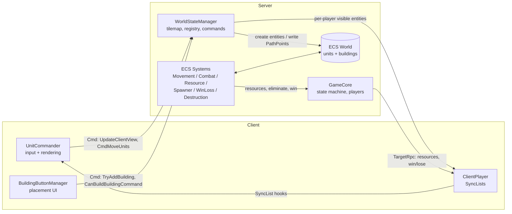
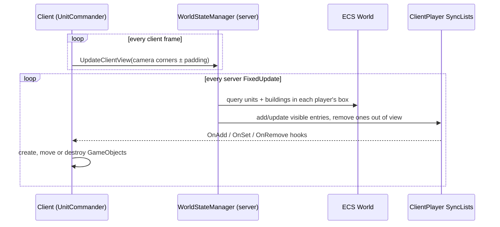
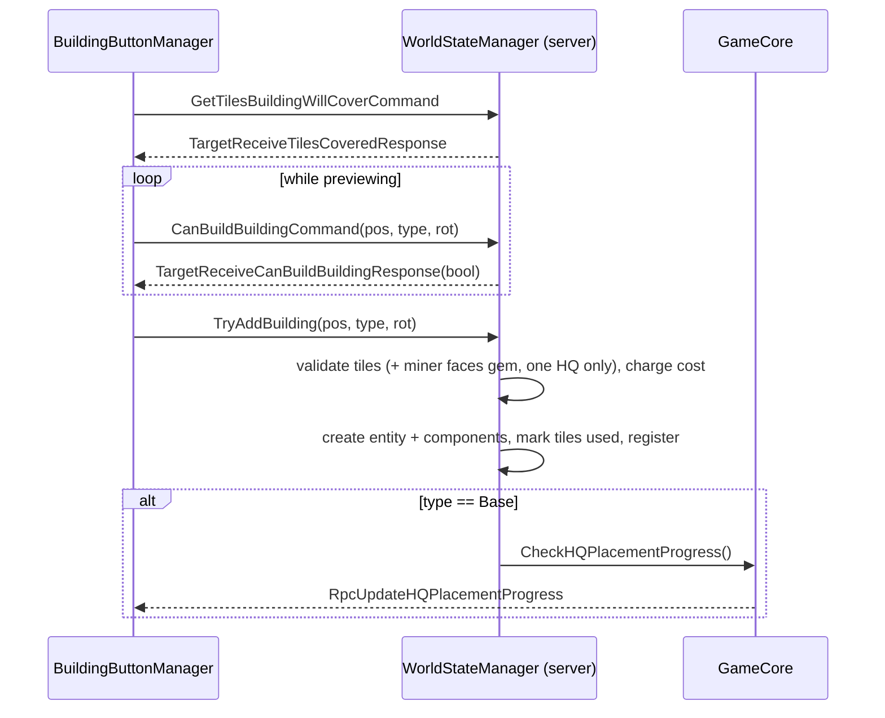

# Architecture

WAR-2D combines two models:

- **Mirror** handles connections, players, scene changes and all client↔server messaging.
- **Unity DOTS (Entities)** holds and simulates the game world. Units and buildings are ECS entities that exist **only on the server**.

Clients never see the ECS world directly. The server copies the entities inside each player's camera view into that player's `SyncList`s, and the client draws plain GameObjects from those lists.



## Scenes and lifetime

| Scene | Contains | Notes |
|---|---|---|
| `Assets/Main_Menu.unity` | `GameManager` (Mirror `NetworkManager` + `KcpTransport`, port 7778), `GameCore`, `LobbySystem`, TIM Console + `Custom_Commands` | Offline scene. `GameManager` and `GameCore` are `DontDestroyOnLoad` singletons. |
| `Assets/Maps/Map_2.unity` | `WorldStateManager`, `UnitCommander`, `BuildingButtonManager`, `HQPlacementUI`, `ResourceUI`, camera with `Character_Controler`, walkable and unwalkable tilemaps | Loaded by `GameCore.Cmd_StartGame` → `ServerChangeScene("Map_2")` (the scene name is hard-coded). |
| `Assets/Player.prefab` | `ClientPlayer` | Mirror player prefab, auto-created for each connection and `DontDestroyOnLoad`. |

`GameManager.LeaveLobby()` stops the host or client, destroys the `GameCore` and `WorldStateManager` objects, and reloads `Main_Menu`.

## Core classes

### `GameManager` (`Scripts/GameManager.cs`): `NetworkManager`
- Loads `GameConfig.xml` in `Awake`.
- **`OnServerAddPlayer`** creates a `ServerPlayer` with the configured starting resources and adds it to `GameCore.ServerPlayers`. The first player becomes the server owner.
- **`OnServerDisconnect`** forwards to `GameCore.OnPlayerLeave`.
- `OnSceneLoaded` wires the main-menu buttons by **tag** (`Host`, `Join`, `Leave`, `Quit`, `LobbyManager`).
- Public actions: `HostServer`, `ConnectToServer(address)`, `ConnectToServerThroughUI`, `ConnectToServerDebug` (localhost), `LeaveLobby`, `QuitGame`.

### `GameCore` (`Scripts/GameCore.cs`): `NetworkBehaviour`, server game state
- `[SyncVar] CurrentState : GameState` (`Lobby`, `PlacingHQ`, `Countdown`, `Playing`, `GameOver`).
- `ServerPlayers : Dictionary<NetworkIdentity, ServerPlayer>` is the authoritative player list.
- Every `LateUpdate` it sends each player their serialized `ServerData` (JSON via Newtonsoft) through `ClientPlayer.SetServerPlayer` (TargetRpc).
- State transitions:
  - `Cmd_StartGame`: Lobby → PlacingHQ
  - `CheckHQPlacementProgress`: → Countdown
  - `Update` timer: → Playing
  - `DeclareWinner` / `DeclareDraw`: → GameOver
- `EliminatePlayer`, `DeclareWinner(id)` and `DeclareDraw()` (implemented as `DeclareWinner(-1)`) send the Win/Lose TargetRpcs. `DeclareWinner` also wipes all entities.

### `ServerPlayer` / `ServerData` (`Scripts/ServerPlayer.cs`)
- `ServerPlayer` is a plain C# object, server only. It holds the connection, a `PlayerState` (`Playing`, `Eliminated`, `Spectating`) and `ServerData`.
- `ServerData` holds what the client is allowed to know privately. Currently that's just `resources`.

### `ClientPlayer` (`Scripts/ClientPlayer.cs`): `NetworkBehaviour` on the player prefab
- `[SyncVar] nickname`, `[SyncVar] hasPlacedHQ`.
- `SyncList<ClientUnit> visuableUnits`, `SyncList<BuildingData> visuableBuildings`, `SyncList<HealthComponent> entityHealth`. The server fills these with only what this player can see.
- `SetUnitHandles` / `SetBuildingHandles` connect the SyncList `OnAdd/OnInsert/OnSet/OnRemove/OnClear` callbacks to `UnitCommander`. `UnitCommander.Awake` calls them when `Map_2` loads.
- It receives these TargetRpcs: `SetServerPlayer`, `TargetUpdateResources`, `TargetReceiveCanBuildBuildingResponse`, `TargetReceiveTilesCoveredResponse`, `RpcOnPlayerWon`, `RpcOnPlayerLost`. The last two load `Resources/UI/WinScreenUI` or `LoseScreenUI` and disable the HUD canvas.

### `WorldStateManager` (`Scripts/Unit/WorldStateManager.cs`): `NetworkBehaviour`, the world gateway
- In `Awake` it builds a `TilemapStruct` (`NativeHashMap<int2, TileNode>`) from `WalkableTilemap` and `UnwalkableTilemap`. Unwalkable tiles whose tile asset name contains `"Gems"` become `TileType.Gem`. All others become `Wall`.
- It keeps registries `Units` and `Buildings` (`Dictionary<int id, Entity>`), plus a list of tiles claimed by units for movement.
- It owns every gameplay **Command** clients send (see the table below), and runs `UpdatePlayerViews()` every `FixedUpdate` on the server.
- Building creation happens here (`TryAddBuilding`) with `EntityManager` directly. Unit creation happens in `SpawnerSystem`.
- Debug: enable `showTileMapweights` to draw tile gizmos in play mode. Cyan = gem, red = wall, yellow = occupied, grey scale = weight.

### `UnitCommander` (`Scripts/Client/UnitCommander.cs`): client presentation and input
- Selection box (left drag) and move orders (right click → `CmdMoveUnits`).
- Every frame it sends the camera rectangle, padded by `visualAdditionalRange`, through `UpdateClientView`.
- Creates and destroys a GameObject per visible unit or building (sprite loaded with `Resources.Load(<enum name>)`), tweens units toward their synced positions with DOTween, and draws attack tracers.
- Attaches `UnitDataClient` / `BuildingDataClient` (both `DataClient`) for health bars, and `SpawnerClientManager` to Small Unit Spawners for click-to-spawn.

### `BuildingButtonManager` (`Scripts/Building/Building Spawning/BuildingButtonManager.cs`)
- Maps HUD buttons to `BuildingType`s. While placing, it asks the server each frame whether the spot is valid (`CanBuildBuildingCommand` → TargetRpc → preview colour) and places with `TryAddBuilding`.
- `HQPlacementUI` shows the HQ prompt and progress during *PlacingHQ*, and calls `GameCore.Cmd_ReadyToStartGame` after its countdown.

## ECS data model

All components are `IComponentData` structs.

| Component | File | Fields | On |
|---|---|---|---|
| `ClientUnit` | `Unit/UnitIdAuthoring.cs` | `id`, `ownerId`, `position`, `spriteName : UnitType`, `targetId`, `lastAttackTime` | Units. Also the struct synced to clients. |
| `BuildingData` | `Building/Building Spawning/BuildingAuthoring.cs` | `id`, `ownerId`, `position`, `buildingType : BuildingType`, `rotation` | Buildings. Also the struct synced to clients. |
| `HealthComponent` | `Unit/HealthAuthoring.cs` | `entityId`, `currentHealth`, `maxHealth` | Units, buildings |
| `DamageComponent` | `Unit/DamageAuthoring.cs` | `damageAmount`, `range`, `attackSpeed` (seconds between attacks) | Units |
| `MovementComponent` | `Unit/MovementAuthoring.cs` | `speed`, `acceleration`, `currentSpeed`, rotation fields (unused) | Units |
| `PathPoint` (buffer) | `Unit/MovementAuthoring.cs` | `position : int2` | Units: the remaining waypoints |
| `ResourceCostComponent` | `Unit/ResourceCostComponent.cs` | `upfrontCost`, `runningCostPerSecond`, `timeSinceLastCost` | Units |
| `BuildingResourceComponent` | `Building/BuildingResourceComponent.cs` | same as above | Buildings |
| `MiningComponent` | `Building/MiningComponent.cs` | `miningRate`, `timeSinceLastMining`, `isActive` | Miners |
| `SpawnerData` | `Building/Unit Spawner Base/SpawnerAuthoring.cs` | `count` (queue), `ownerId`, `position`, `unitType` | Small Unit Spawners |
| `HQComponent` | `Components/HQComponent.cs` | `ownerId` | HQ (Base) |

Enums: `UnitType { None, Tank, Soldier }`, `BuildingType { None, Miner, SmallUnitSpawner, Base }`, `TileType { Ground, Wall, Gem }`.

**IDs.** Units and buildings get `UnityEngine.Random.Range(0, int.MaxValue)` as `id`. `ownerId` is the owning player's `netId` cast to `int` (`BuildingData.UIntToInt`). Both the registries and the client GameObject dictionaries are keyed by `id`.

The `*Authoring` MonoBehaviours and their Bakers exist for subscene baking. The only subscene (`Maps/Map_Common/Unit Subscene.unity`) is currently empty, so all runtime entities are created from code.

## ECS systems (`Scripts/Systems/`)

All are `ISystem` structs in the default world. They are marked `[Server]` / `[ServerCallback]`, and they only have entities to work on where the server creates them.

| System | Runs | Does |
|---|---|---|
| `MovementSystem` | Every frame | Moves each unit toward `PathPoint[0]` with acceleration. When it arrives, it claims the next tile, pops the waypoint and releases the old tile (through `WorldStateManager`). |
| `CombatSystem` | Every frame | Keeps the current target if it's alive and in range, otherwise picks the nearest enemy-owned entity with health. Applies `damageAmount` every `attackSpeed` seconds and destroys the target at ≤ 0 health. |
| `DestructionSystem` | Every frame | Destroys any entity with `currentHealth <= 0`. |
| `ResourceSystem` | Every frame, *Playing* only | Passive income (applied every 0.1 s), mining (every 1 s, only when facing a gem), upkeep for units and buildings (every 1 s, skipped if unaffordable). Pushes `TargetUpdateResources`. |
| `SpawnerSystem` | Every frame | For each spawner with `count > 0`, charges the upfront cost and creates a unit entity (restoring the count if unaffordable), then registers it with `WorldStateManager.AddUnit`. |
| `WinLossSystem` | Every 1 s, *Playing* only | Counts players that own an `HQComponent` entity and calls `EliminatePlayer` / `DeclareWinner` / `DeclareDraw`. |

## Networking reference

### Client → server (Mirror `[Command]`, all `requiresAuthority = false` except nickname)

| Command | On | Purpose |
|---|---|---|
| `CmdSetNickname(name)` | `ClientPlayer` | Rename in the lobby |
| `Cmd_StartGame()` | `GameCore` | Server owner starts the match |
| `Cmd_ReadyToStartGame()` | `GameCore` | Client finished the HQ countdown UI |
| `UpdateClientView(start, end)` | `WorldStateManager` | Camera rectangle for visibility (sent every frame) |
| `CmdMoveUnits(goal, start, end)` | `WorldStateManager` | Move the sender's units inside the box |
| `TryAddBuilding(pos, type, rot)` | `WorldStateManager` | Validate, charge and create a building |
| `CanBuildBuildingCommand(pos, type, rot)` | `WorldStateManager` | Placement preview validity |
| `GetTilesBuildingWillCoverCommand(center, type)` | `WorldStateManager` | Footprint size (used for the half-tile offset of odd sizes) |
| `BuildingClicked(id)` | `WorldStateManager` | Queue a unit at an owned spawner |

### Server → client

| Mechanism | Member | Purpose |
|---|---|---|
| SyncVar | `GameCore.CurrentState`, `ClientPlayer.nickname`, `ClientPlayer.hasPlacedHQ` | Shared state |
| SyncList | `ClientPlayer.visuableUnits / visuableBuildings / entityHealth` | Per-player visible world |
| TargetRpc | `SetServerPlayer` (every frame), `TargetUpdateResources` | Private resources |
| TargetRpc | `TargetReceiveCanBuildBuildingResponse`, `TargetReceiveTilesCoveredResponse` | Placement replies |
| TargetRpc | `RpcOnPlayerWon`, `RpcOnPlayerLost` | End-of-game screens |
| ClientRpc | `RPC_RemoveClientLobbyUI`, `RpcUpdateHQPlacementProgress`, `RpcGameDraw` | Lobby cleanup, progress logging |

### Visibility (fog of war by camera)



Players see **every** entity inside their camera rectangle, their own and their enemies' alike. There is no line-of-sight or unit-vision radius.

### Building placement



## Pathfinding (`Scripts/Unit/Pathfinding/`)

- 8-directional A* over `TilemapStruct`, Burst-compiled (`Pathfinding.BurstFindPath`) and using `NativePriorityQueue`.
- Node cost is `fcost = (gcost * 0.01 + hcost) * weight`. Because g is heavily discounted, the search behaves close to greedy best-first. The default heuristic is Euclidean, and `HCostMethod` lists others.
- `WorldStateManager.MoveUnit` calls it synchronously (`doJob: false`) and writes the result into the unit's `PathPoint` buffer.
- `FindBestGoalLocation` runs a BFS out from the clicked tile so each unit in a group gets a different free goal.
- `Pathfinding.FindPath` (managed version using `Data/PriorityQueue.cs`) is an older non-Burst path. `Assets/PathfindingResults.csv` holds timing samples from earlier testing.

## Configuration

| Source | Loaded by | Used for |
|---|---|---|
| `Assets/Resources/GameConfig.xml` | `Config.ConfigLoader.LoadConfig()` (cached) | Starting resources, passive and mining rates, unit stats and costs, building health |
| `Resources/Data/ResourceConfig.xml` (**does not exist**) | `ResourceConfigLoader` (falls back to defaults) | Building upfront and running costs, miner `miningRate` field |
| `Assets/Game_Manager_Settings.asset` (`GameManagerSettings`) | `GameManager.settings` | Fields `initalResources` and `coreBaseName`. Only null-checked, not read. |
| `Assets/Character_Settings.asset` (`Character.Character_Settings`) | `Character_Controler` | Camera speed, zoom, shift multiplier |

`GameConfig.xml` schema:

```xml
<GameConfig>
  <Resources>
    <PassiveGenerationRate/> <StartingResources/> <MiningRate/>
  </Resources>
  <Units>
    <Unit type="Tank"> <!-- must match a UnitType enum name -->
      <Health/> <Damage/> <MoveSpeed/> <UpfrontCost/> <RunningCost/>
    </Unit>
  </Units>
  <Buildings>
    <Building type="Miner"> <!-- must match a BuildingType enum name -->
      <Health/> <UpfrontCost/> <RunningCost/> <MiningRate/> <SpawnRate/>
    </Building>
  </Buildings>
</GameConfig>
```

## Asset naming conventions

Sprites are loaded by enum name from the root of `Resources/`, e.g. `Resources.Load<Sprite>("Tank")`, `"Miner"`, `"SmallUnitSpawner"`. So a new `UnitType` or `BuildingType` needs a sprite with exactly that name directly in `Assets/Resources/`. A building's tile footprint comes from that sprite's size divided by its pixels-per-unit (except `Base`, which is fixed at 3×3).

## Developer tools

- **TIM Console** (`` ` `` to toggle). Custom commands live in `Assets/3rd Party/Console/Custom Commands/Custom_Commands.cs`: help, server player count, server/client active, GameCore null check, players' resources, WorldStateManager.
- **NaughtyAttributes** `[Button]`s on `UnitDataClient` / `BuildingDataClient` print a clicked object's synced data in the inspector.
- `FPSViewer` (`Scripts/Optimisations/FPS Viewer.cs`) shows a simple FPS readout.
