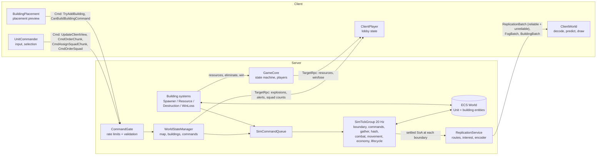
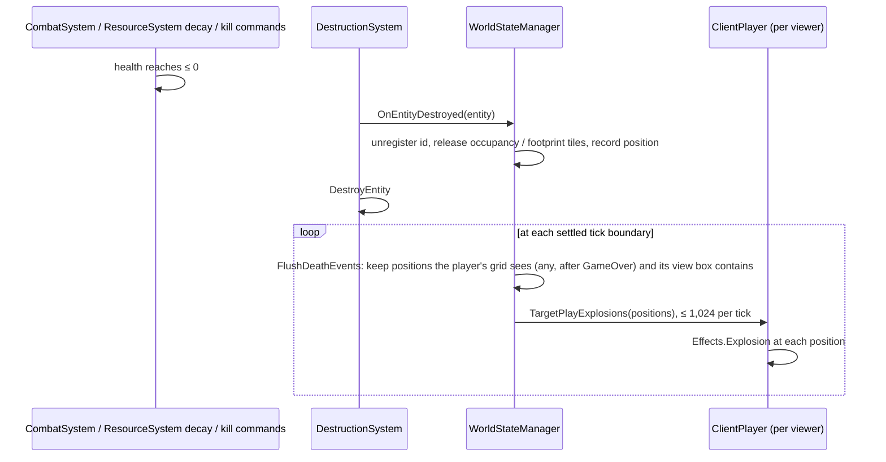

# Architecture

WAR-2D combines two models:

- **Mirror** handles connections, players, scene changes and all client↔server messaging.
- **Unity DOTS (Entities)** holds and simulates the game world. Units and buildings are ECS entities that exist **only on the server**.

Clients never see the ECS world. Units reach them through the **replication encoder**: each client gets its own units and the units its fog of war (its sight plus vision shared with it) sees, as routes plus corrections, and predicts and draws them with GPU instancing. Buildings (a few hundred at most) go through the same service as per-client building records (`BuildingBatch`) and are drawn as GameObjects; the fog itself reaches each client as its own team's grid (`FogBatch`).

The server simulates units in an **asynchronous 20 Hz tick**: a fixed-rate system group whose Burst jobs run on worker threads between ticks and are settled at the next tick boundary. Main-thread code never touches unit entities; it queues `SimCommand`s that the tick applies at its boundary.



## Assemblies

| Assembly | Where | Contents |
|---|---|---|
| `WAR2D` | `Assets/Scripts/WAR2D.asmdef` | All game code. References Mirror, Entities, Burst, Collections, Mathematics, Transforms, TextMeshPro, UnityEngine.UI, Input System, 2D Tilemap Extras, NaughtyAttributes and TIM Console; DOTween as a precompiled reference. |
| `WAR2D.Tests.EditMode` | `Assets/Tests/EditMode/` | Editor-only rule, parser, validation, simulation (`SimHarness`), flow-field and replication tests. |
| `WAR2D.Tests.PlayMode` | `Assets/Tests/PlayMode/` | Hosted-match tests that run in play mode, plus the performance regression guard (Unity Performance Testing). |
| Vendored | `Assets/Mirror/`, `Assets/3rd Party/`, `Assets/Plugins/` | Mirror, TIM Console, NaughtyAttributes, DOTween. |

Game code moved into its own assembly in v0.2, which is what lets the test assemblies reference it.

## Scenes and lifetime

| Scene | Contains | Notes |
|---|---|---|
| `Assets/Main_Menu.unity` | `GameManager` (Mirror `NetworkManager` + `MultiplexTransport`: KCP and SimpleWebTransport, both on port 7778), the `Menu` UI (`UIDocument`, `MenuController`, `MenuBattle`), `Custom_Commands` | Offline scene. `GameManager` is a `DontDestroyOnLoad` singleton. `GameCore` is **not** in the scene: the server spawns it from `Resources/Network/GameCore.prefab` when it starts (see `GameManager`). |
| `Assets/Maps/Map_2.unity` | `WorldStateManager`, `UnitCommander` (adds `ClientWorld` on clients), `BuildingPlacement`, the `HUD` (`UIDocument` + `HudController`), orthographic camera with `Character_Controler` and a `Physics2DRaycaster`, walkable and unwalkable tilemaps | Loaded by `GameCore.Cmd_StartGame` → `ServerChangeScene`, using the scene name from `GameConfig.xml` (`Match.Scene`, currently `Map_2`). With `Match/Map/Size > 0` (the default, 1024) the map is generated and the scene's tilemaps are hidden; with 0 the tilemaps are the map (the PlayMode tests use this). |
| `Assets/Player.prefab` | `ClientPlayer` | Mirror player prefab, auto-created for each connection and `DontDestroyOnLoad`. |
| `Assets/Resources/Network/GameCore.prefab` | `GameCore` | Spawned by the server in `GameManager.OnStartServer` and registered with clients in `GameManager.Awake` (`spawnPrefabs`); `DontDestroyOnLoad` once spawned, destroyed by Mirror when the server or client stops. A spawned prefab rather than a scene object: in the editor, the scene play mode starts in never gets Mirror's scene post-process, so a scene object that moves itself to `DontDestroyOnLoad` kept an id a build client couldn't match. |

`GameManager.LeaveLobby()` stops the host or client, destroys the `GameCore` and `WorldStateManager` objects, and reloads `Main_Menu`.

## Core classes

### `GameManager` (`Scripts/GameManager.cs`): `NetworkManager`
- Loads `GameConfig.xml` in `Awake` and adds the `GameCore` prefab to `spawnPrefabs`. `OnStartServer` stops the server on an invalid config (and quits, in batch mode), then spawns `GameCore`.
- **No headless auto-start.** `Awake` sets Mirror's `headlessStartMode` to `DoNothing`: there is no dedicated server, and a batch-mode player is a perf client (or a test) that starts its own networking. Mirror's default made every `-perfClient` process host on port 7778 instead of joining.
- **`OnServerConnect`** closes the connection unless the match is in the lobby and has room (`LobbyRules.MayJoin`: *Lobby* only, at most `LobbyRules.MaxPlayers` = 8 connections). The joining client's Play screen then says the match has started or is full.
- **`OnServerAddPlayer`** creates a `ServerPlayer` with the configured starting resources and adds it to `GameCore.ServerPlayers`.
- **`OnServerDisconnect`** stops replication to the connection and forwards to `GameCore.OnPlayerLeave`.
- **`OnStartClient`** registers the `ReplicationBatch`, `FogBatch` and `BuildingBatch` handlers (`ReplicationClient`, `ClientFog`, `ClientBuildings`).
- The menus are UI Toolkit (`MenuController`, see "Menus" below).
- Public actions: `HostServer`, `ConnectToServer(address)`, `LeaveLobby`, `QuitGame`.

### `GameCore` (`Scripts/GameCore.cs`): `NetworkBehaviour`, server game state
- Spawned by the server from `Resources/Network/GameCore.prefab` (not a scene object); `Instance` is cleared when it is destroyed.
- `[SyncVar] CurrentState : GameState` (`Lobby`, `PlacingHQ`, `Countdown`, `Playing`, `GameOver`), `[SyncVar] CountdownEndTime`, and the public lobby and match data `Settings` (`MatchSettings`), `DiplomacyEnabled` and `MatchStartTime`.
- `ServerPlayers : Dictionary<NetworkIdentity, ServerPlayer>` is the authoritative player list. `MatchStartPlayerCount` records how many players were present when the match launched (so a departure before *Playing* can't stop the survivor from winning).
- `Teams : SyncDictionary<int, int>` maps each owner id to its team, fixed by `Cmd_StartGame` from the lobby choices (`TeamRules.Assign`: players who picked the same team share one, the rest are solo; bots get their own). `TeamOf` reads it. It is only the starting state of diplomacy (`SimContext.Diplomacy`, see the tick section): from Playing on, who attacks and shares vision with whom is per player and one-way. The host sets choices with `Cmd_SetTeam(playerNetId, team)` (server owner, *Lobby* only, and only choices a player could make for themselves: `LobbyRules.IsTeamChoiceValid`, so Solo only in Free-for-all).
- `PlayerOrder : SyncList<int>` holds the owner ids in match order: join order (ascending net id), as the lobby lists the players and colours the HQ sites. An owner's index here is its bit in the diplomacy masks and picks the clearing the camera starts on; colours come from each player's lobby `colourIndex`.
- `Bots` are connectionless players for the performance harness only (`AddBot`, refused unless `DevApi.Allowed`). They count in the player order, the match's player count and win/loss.
- Server ownership: `SetServerOwner`/`IsServerOwner`. The owner is the only player allowed to start a match, and ownership transfers when the owner leaves.
- `Cmd_StartGame` (owner only, *Lobby* only, valid config only) resets each player's `hasPlacedHQ`, captures `MatchStartPlayerCount` and `MatchStartTeamCount`, fixes `Teams`, switches to *PlacingHQ* and loads the configured map.
- `CheckHQPlacementProgress` starts the *Countdown* once every player has placed an HQ. `Update` switches to *Playing* at `CountdownEndTime`.
- `ApplyOutcome(MatchOutcome)` (from `WinLossSystem`) eliminates the newly HQ-less players and ends the match on a win or draw.
- `EliminatePlayer`, `DeclareWinner` and `DeclareDraw` send the Win/Lose/Draw TargetRpcs and wipe entities (through `WorldStateManager`).
- `OnPlayerLeave` removes the player, forgets their rate-limit buckets, drops their view and destroys their entities; it transfers ownership or, when the host leaves, shuts down with the server.
- Every `LateUpdate` it sends each player their resources via `TargetUpdateResources` **only when they changed**, at most every 0.1 s (`ResourcesDirty`).

### `ServerPlayer` (`Scripts/ServerPlayer.cs`)
- `ServerPlayer` is a plain C# object, server only: the connection, a `PlayerState` (`Playing`, `Eliminated`, `Spectating`), and `Resources` with a dirty flag. `Add` ignores non-positive amounts (including NaN); `TrySpend` goes through `UpkeepRules.TryCharge`.
- The client only learns a player's own resources, through the TargetRpc above — never a SyncVar.

### `ClientPlayer` (`Scripts/ClientPlayer.cs`): `NetworkBehaviour` on the player prefab
- `[SyncVar] nickname`, `hasPlacedHQ`, `isServerOwner` (drives the lobby Start button, including when ownership transfers).
- `[SyncVar] startSite`: the HQ clearing (index into `MapStore.HqSites`) the player claimed with `GameCore.Cmd_SetStartSite` (*Lobby* only, a free site or `LobbyRules.NoStartSite` to give it up), or was given by `Cmd_StartGame` (`LobbyRules.AssignStartSites`: claims kept, the rest get the lowest free sites in owner order). `WorldStateManager.CheckPlacement` refuses an HQ with any footprint tile outside that clearing (`PlacementResult.OutsideHqClearing`, radius `MapGenerator.HqClearRadius`); players without one (dev bots, the scene's tilemap map) are unconstrained. `BuildingPlacement` rings the clearing (`Client/ClearingRing`) until the HQ is placed, and the HUD starts the camera on it.
- `[SyncVar] colourIndex` (0–7, unique in the lobby), `ready`, and `lobbyTeam`: the team the player was put on in the lobby (`TeamRules.NoTeam` = solo), shown in each lobby row and cycled by the host's team pill.
- It receives these TargetRpcs: `TargetUpdateResources` (resources plus last second's income and upkeep, kept by `ServerPlayer.AddIncome`/`AddUpkeep` and rolled once a second by `GameCore`), `TargetReceiveCanBuildBuildingResponse`, `TargetPlayExplosions`, `TargetSpawnerQueue`, `TargetSquadCounts`, `TargetAlerts`, `TargetDiplomacy`, `TargetGift`, `RpcOnPlayerWon`, `RpcOnPlayerLost` and `RpcOnMatchDraw`. The end screen is a HUD layer (`EndScreenController`, raised through `ClientPlayer.MatchEnded`).
- `CmdSetNickname` is the one authority-checked command here; it goes through `CommandGate` and `CommandValidator.TrySanitizeNickname`.

### `WorldStateManager` (`Scripts/Unit/WorldStateManager.cs`): `NetworkBehaviour`, the world gateway
- In `OnStartServer` it builds `Map` (a `MapStore`, see "Map" below), then creates the match's simulation (`Sim`, a `SimContext`) and unit replication (`Replication`, a `ReplicationService`), and registers every connected player with replication. `OnDestroy` disposes all three.
- `Ids => Sim.Ids` (the match's `NetIdAllocator`), a `Buildings` registry (`Dictionary<int id, Entity>`) and a `buildingFootprints` map so a destroyed building frees its tiles.
- It owns every world **Command** clients send (see the table below), fills `ReplicationService.CollectBuildings` with every live building, and on each settled boundary (`SimContext.Settled`) flushes death explosions (`FlushDeathEvents`). The order and squad commands live in `Net/OrderCommands.cs` (`WorldStateManager` is `partial`).
- `TryAddBuilding` validates, charges, reserves the footprint (`MapStore.QueueUsed`) and sets `hasPlacedHQ`, then queues `CreateBuilding`; the entity appears at the next tick boundary. Spawners queue `SpawnUnit`.
- `OnEntityDestroyed` (called by `DestructionSystem`) unregisters a building, frees its id and footprint, and records a death position; unit deaths arrive through `SimContext.UnitDied`. `KillAllEntitiesOwnedBy` zeros the player's buildings' health and queues `KillOwner` (and forgets their squads); `DestroyAllEntities` wipes buildings and queues `DestroyAll` at match end.
- Dev only (`DevApi.Allowed`): `DevPlaceBuilding` and `DevSpawnUnit` for the performance harness.

## Map (`Scripts/World/`)

- `MapGrid` is the tile grid: `Width`, `Height`, `Tiles` (`(byte)TileType` per tile: Ground 0, Wall 1, Gem 2, Border 3) and `Used` (1 under a building footprint), row-major with tile (x, y) covering [x, x+1). Off-map reads as `Border`. **Grid tiles are world tiles**, so the map starts at (0, 0) and `WorldStateManager.MapBounds` is `(0, size − 1)`.
- `MapStore` owns the grid's native memory. `Generate(size, seed, gemChance)` runs `MapGenerator` (the v0.3 cave generator: 45 % rock smoothed four times, eight HQ clearings on a circle joined to the centre by corridors, unreachable floor filled in, gems on floor-facing rock, a guaranteed gem vein beside each clearing, a border ring). `FromTilemaps` reads Map_2's tilemaps through `CellToWorld`; Map_2's Ground and Walls tilemaps are offset by (29, 45) so every tile is non-negative. The tick's movement job reads `Used`, so main-thread code between ticks never writes it: `QueueUsed` queues a footprint change, `IsUsed` / `IsWalkable` see queued changes at once (no footprint is booked twice), and `OrderBook.AtBoundary` applies the queue (`ApplyPendingUsed`, then `SetUsed`, which records `ChangedTiles`) once the jobs are complete. `Hash()` is FNV-1a over the tile kinds.
- Generated maps reach clients as three SyncVars on `WorldStateManager`: `MapSize`, `MapSeed`, `MapHash`. A client regenerates the map, disconnects on a hash mismatch (`[Map] hash mismatch`), hides the tilemap renderers and draws the map with `MapView`: one point-filtered texture, one texel per tile, on a quad at z = 1. A 1024² map generates in about 170 ms.

### `UnitCommander` (`Scripts/Client/UnitCommander.cs`): client presentation and input
- Owns the local `Selection` (`Client/Selection.cs`): left drag selects every own unit in the box (no limit; Shift adds), right click orders the selection, Ctrl+1–0 assigns a squad (an empty selection empties it) and 1–0 selects one; a click that hits none of your units but your spawner's footprint selects the spawner (`SelectBuilding`). `SpawnerClientManager` only marks spawner GameObjects; the commander alone decides what a click selects. Move and Attack-move can be armed (`ArmedOrder`) by the `A` key or the command card, and the next click sends them. Orders go out as chunked id lists, or as one `CmdOrderSquad` when the selection is exactly a squad.
- Sends its camera rectangle (padded by `visualAdditionalRange`, clamped to the map) through `UpdateClientView`, only when it changes and at most every 0.1 s.
- Adds `ClientWorld` on clients and calls `ClientWorld.Draw(selection)` from `LateUpdate`.
- Buildings: creates a GameObject per building `ClientBuildings` reports (dimmed while a ghost: out of sight, shown as last seen) (sprite loaded by enum name), with `BuildingDataClient` for health and `SpawnerClientManager` on Small Unit Spawners for click-to-spawn.

### `ClientWorld` (`Scripts/Client/ClientWorld.cs`): the client's units
- Wraps a `ClientUnitStore`, which decodes `ReplicationBatch` payloads (Enter, Leave, MoveOrder, Correction, Health, Attack) and predicts every known unit with `MovementPrediction`, the same code the server's encoder runs, so the server knows the client's position bit for bit. A malformed batch is logged and dropped.
- `ServerTime` advances with real time and is nudged (≤ 10 % a frame, never backward) toward the newest batch's tick plus the time since it arrived; a quiet server sends no batches, but its clock keeps running.
- Every frame a Burst job predicts all known units; `Draw` packs them into `UnitInstance`s (position, facing from motion, owner colour from `GameCore.PlayerOrder`, selection highlight) and draws them with `InstancedUnitRenderer`: one `Graphics.RenderPrimitives` call for units and one for the damaged units' health bars (`Resources/Shaders/InstancedUnit.shader`).
- **Drawn positions are smoothed.** A correction (or new route) moves a unit's prediction at once, which must stay bit-identical to the server's copy, so `Draw` uses `ClientUnitStore.Drawn` instead: the prediction plus the jump the correction made, faded out over `BlendSeconds` (0.1 s). Jumps over `MaxBlendTiles` (2) are drawn as they are. Gameplay (selection, the minimap, tracers) keeps reading `Predicted`.
- `Attack` events become tracers for attackers on screen (≤ 200 a frame).
- `TryGet`, `IsKnownId` and `QueryBox` serve selection.

### `BuildingPlacement` (`Scripts/Building/Building Spawning/BuildingPlacement.cs`)
- Started by the command card's build buttons (`BeginPlacement`), and on its own with the HQ during *PlacingHQ* until `hasPlacedHQ`. While placing, it asks the server whether the spot is valid (change-gated and throttled `CanBuildBuildingCommand` → TargetRpc → preview colour), places with `TryAddBuilding` on left-click and cancels on right-click. `UnitCommander` leaves that frame's clicks to it.
- The HQ prompt, progress and the server-owned countdown (from `GameCore.CountdownEndTime`) are HUD overlays (`HudOverlayController`).

## ECS data model

All components are `IComponentData` structs.

| Component | File | Fields | On |
|---|---|---|---|
| `Unit` | `Sim/SimComponents.cs` | `Id`, `OwnerId`, `OwnerSlot`, `Type`, `SizeClass`, `TargetKind`, `Radius`, `Health`, `MaxHealth`, `Position`, `Velocity`, `TargetId` (unit or building id, or −1), `Cooldown`, `OrderSlot` (order handle or −1), `Unpaid`, `Stance`, `LastHitBy` (owner of the last attacker) | Units: the only unit component |
| `SimData` (singleton) | `Sim/SimData.cs` | The map arrays (not owned), per-type balance tables, the damage table, and the SoA scratch every stage runs over (positions, health, owners, ids, hash cells, targets…), building targets, attack events, death queue, pending orders/moves, order table, economy arrays | The sim singleton |
| `SimClock` (singleton) | `Sim/SimComponents.cs` | `Tick`, `Running`, `Dt`, `UnitCount` | The sim singleton |
| `MapGrid` | `World/MapGrid.cs` | `Width`, `Height`, `Tiles`, `Used` | A plain struct the sim and pathing copy |
| `BuildingData` | `Components/BuildingComponents.cs` | `id`, `ownerId`, `position` (footprint anchor), `buildingType`, `rotation` (degrees) | Buildings. Also the struct synced to clients. |
| `HealthComponent` | `Components/UnitComponents.cs` | `entityId`, `currentHealth`, `maxHealth` | Buildings |
| `UpkeepComponent` | `Components/UpkeepComponent.cs` | `ownerId`, `runningCostPerSecond`, `timeSinceLastCharge`, `unpaid` | Buildings |
| `MiningComponent` | `Building/MiningComponent.cs` | `timeSinceLastMining`, `isActive` | Miners |
| `SpawnerData` | `Components/BuildingComponents.cs` | `count` (queue), `ownerId`, `position`, `unitType`, `spawnRate`, `timeSinceLastSpawn` | Small Unit Spawners |
| `HQComponent` | `Components/HQComponent.cs` | `ownerId` | HQ (Base) |

Enums: `UnitType { None, Tank }`, `BuildingType { None, Miner, SmallUnitSpawner, Base }`, `TileType { Ground, Wall, Gem, Border }`, `TargetClass { Unit, Building, Wall }`.

**IDs.** Units and buildings share one `NetIdAllocator` per match: an id is `(generation << 20) | index`. The index (below `MaxEntities`) addresses every per-unit array, and the generation (1..2047, wrapping) changes when an index is reused, so a stale id never matches a newer entity. `ownerId` is the owning player's `netId` cast to `int` (`BuildingData.UIntToInt`). Nothing is keyed by `Entity.Index`.

## The simulation tick (`Scripts/Sim/`)

`SimTickGroup` (in `SimulationSystemGroup`) runs at `Simulation/TickRate` (20 Hz) through a `FixedRateCatchUpManager`. `SimContext` (created by `WorldStateManager.OnStartServer`) owns the singletons, the id allocator, the `SimCommandQueue`, the `OrderBook`, the `WaypointBook` and the owner slots; the systems do nothing until it exists. Stages in order:

| System | Does |
|---|---|
| `SimBoundarySystem` (first, managed) | `CompleteAllTrackedJobs` (the previous tick's jobs) → destroys the units the lifecycle queued (freeing ids, raising `UnitDied` for explosions) → takes last second's upkeep from the owners (`SimContext.Spend`) and refreshes budgets (`BudgetOf`) → `OrderBook.AtBoundary` (publish rebuilt flow fields, apply queued footprints and the terrain changes they make, retire orders with no followers, extend routes to sectors units wandered into) → raises `Settled` (replication runs here on the settled SoA) → sets `Running` (server, *Playing* or *GameOver*: `RunsIn`; *GameOver* so the match-end wipe is settled once more and reaches clients as explosions and Leaves). Later stages return at once while not running. |
| `SimCommandSystem` (managed) | Writes last tick's building damage to `HealthComponent`s, sends each unit in `SimData.Arrivals` (written by movement when a unit reaches its goal) on to its next `WaypointBook` waypoint (units popping the same goal, stance and size class share one order), then drains the queue: `CreateBuilding` (and pushes units out of the new footprint), `KillOwner` and `DestroyAll` in any state; `SpawnUnit` (refused over `MaxUnitsPerPlayer`) and `OrderUnits` only while running (deferred otherwise). `OrderUnits` carries an `OrderKind` (Move, AttackMove, Hold, Stop) that sets the unit's `Stance`; a Shift-queued Move or AttackMove is appended to the `WaypointBook` of each unit with a live order (up to `Orders/MaxQueued`), and any other order clears the unit's waypoints. Every structural change to units happens here. |
| `SimGatherSystem` | Counts units and gathers building targets on the main thread, then a parallel job copies each `Unit` into its SoA slot, applying pending orders and moves. |
| `SimHashSystem` | Counting-sort spatial hashes of units and buildings (`HashCellSize` 5). |
| `SimCombatSystem` | Resolves last tick's targets (a unit on a live `Move` order has none), runs the sliced nearest-enemy search (a unit searches every `TargetSearchSliceTicks` ticks; enemy units first, then enemy buildings), attacks on cooldown for `Damage × DamageTable(type, target class)`, applies damage with one writer, records attack events, writes back. |
| `SimMovementSystem` | Follows the order's flow field from the `OrderFieldTable` (aiming at the next cell's centre), holds while it has a target (except on a `Move` order; a `Hold` unit never moves and gets no separation push), steers straight at the goal and reports a route miss when off the route, separates (every `SeparationIntervalTicks`), integrates without entering blocked tiles, counts each order's followers. A unit standing on floor inside a field cell that holds wall (fields run on 2×2-tile cells, so cave edges are full of them) has no direction there; it steers to the nearest neighbouring cell that has one instead of heading straight at the goal into the wall. A unit stops within `0.5 + 0.4·√followers` tiles of the goal. |
| `SimVisionSystem` | Every `VisionIntervalTicks` (5 Hz): each owner slot's fog grid (`FogCellSize` tiles per cell) is cleared and re-stamped from every living unit and building (each source goes on its owner's grid and on the grid of every slot its owner shares vision with, `SimData.ShareVisionMask`; sources merged per grid and cell; Bresenham line of sight against opaque cells, skipped on open ground via a summed-area table). Changed cells are queued on `FogChanges` for replication and seen cells added to `Explored`. Grid g is owner slot g; a grid keeps its `Explored` memory when sharing stops. |
| `SimEconomySystem` | Once a second charges each owner's units their running cost in slot order until the owner's budget runs out (the rest are unpaid); unpaid units decay; counts units per owner. |
| `SimLifecycleSystem` | Queues every unit at 0 health for the next boundary. |
| `SimEndSystem` (last) | Schedules up to `MaxFieldRebuildsPerTick` flow-field rebuilds (completed at the next boundary) and closes the main-thread timing (`SimTiming`). |

Every stage declares write access to `Unit`, which chains their jobs without a sync point; no stage completes its own jobs.

## Building systems (`Scripts/Systems/`)

`ISystem` structs in the default world, server only, on building components (no tick job touches them):

| System | Runs | Does |
|---|---|---|
| `SpawnerSystem` | Every frame, *Playing* only | Spawner timing and cost; queues `SpawnUnit` on the nearest free walkable tile outside the footprint. A refused spawn (unit cap) is refunded and the queue kept. |
| `ResourceSystem` | Every frame, *Playing* only | Passive income, mining (every 1 s, only when the miner faces a gem), and building upkeep and decay. |
| `DestructionSystem` | Every frame | Destroys buildings at ≤ 0 health, calling `WorldStateManager.OnEntityDestroyed` first. |
| `WinLossSystem` | Every 1 s, *Playing* only | Applies `WinLossRules.Evaluate` to the players (and bots) that own a living HQ. |

## Rule and net helpers

- **`Scripts/Rules/`** — `PlacementRules`, `MinerRules`, `Footprint`, `DamageTable` (Burst-friendly multipliers), `SpawnerRules`, `UpkeepRules`, `WinLossRules`, `TileSearch`, `VisibilityRules`.
- **`Scripts/Net/`** — `CommandGate`, `RateLimiter`, `CommandValidator` (box span, nickname, squad index, bounds), `NetIdAllocator`, `OrderIdCodec` (chunked delta-varint id lists), `OrderCommands.cs`, and `Replication/` (below).

## Networking reference

### Client → server (Mirror `[Command]`)

| Command | On | Purpose | Budget (burst, /s) | Validation |
|---|---|---|---|---|
| `CmdSetNickname(name)` | `ClientPlayer` | Rename in the lobby | 5, 1 | nickname sanitised; *Lobby* only |
| `Cmd_StartGame()` | `GameCore` | Server owner starts the match | 3, 0.5 | ownership, *Lobby*, valid config, `LobbyRules.CanStart` (all ready, ≥ 2 teams; skipped under `DevApi.Allowed`) |
| `Cmd_SetMatchSettings(settings)` | `GameCore` | Host changes mode, diplomacy, map size, seed, starting resources | 10, 4 | ownership, *Lobby*, `MatchSettingsRules.IsValid` (values from `<Lobby>`); clears every ready flag |
| `Cmd_RerollMap()` | `GameCore` | Host picks a new random seed | 5, 2 | ownership, *Lobby*; clears every ready flag |
| `Cmd_SetTeam(playerNetId, team)` | `GameCore` | Host sets a player's lobby team | 10, 5 | ownership, *Lobby*, `LobbyRules.IsTeamChoiceValid` |
| `Cmd_SetColour(colour)` | `GameCore` | Pick a palette colour | 10, 4 | *Lobby*, sender in the lobby, `LobbyRules.IsColourFree` (0–7, unused) |
| `Cmd_SetReady(ready)` | `GameCore` | Ready up or cancel | 10, 4 | *Lobby*, sender in the lobby |
| `Cmd_SetOwnTeam(team)` | `GameCore` | Pick one's own team | 10, 4 | *Lobby*, `LobbyRules.IsTeamChoiceValid` |
| `Cmd_Surrender()` | `GameCore` | Leave the match as if the HQ fell | 3, 0.5 | *Playing*, sender still playing |
| `Cmd_GiftResources(targetNetId, amount)` | `GameCore` | Give resources to another live player | 5, 1 | `GiftRules.CanGift` (*Playing*, both playing, not self, cooldown) and `GiftRules.IsValid` (finite, ≥ 1, ≤ balance) |
| `Cmd_SetAttack(targetNetId, on)`, `Cmd_SetShareVision(targetNetId, on)` | `GameCore` | Diplomacy | 10, 2 each | `DiplomacyRules.CanChange` (diplomacy on, *Playing*, both playing, not self, per-command cooldown) |
| `UpdateClientView(start, end)` | `WorldStateManager` | Camera rectangle (correction fidelity and explosions only; never widens what the client may know) | 20, 15 | box span; clamped to the map |
| `CmdOrderChunk(token, ids, final, kind, queue, goal)` | `WorldStateManager` | One chunk of an order (`OrderKind`: Move, AttackMove, Hold, Stop; `queue` = Shift) | 40, 20 | *Playing*, player still playing; known kind, goal inside the map for Move/AttackMove; `OrderIdCodec.TryDecode` (≤ 2,048 ids, ≤ 8 KB, strictly ascending; an empty chunk is no ids); ≤ `MaxUnitsPerPlayer` ids per token; ≤ 4 open tokens, dropped after 2 s; the sim skips ids that aren't the sender's or aren't live |
| `CmdAssignSquadChunk(token, squad, ids, final)` | `WorldStateManager` | One chunk of a squad assignment (empty = empty the squad) | 40, 10 | as above, plus squad 0..9 |
| `CmdOrderSquad(squad, kind, queue, goal)` | `WorldStateManager` | Order a squad's living members | 10, 5 | squad 0..9; as `CmdOrderChunk`; dead members pruned |
| `TryAddBuilding(pos, type, rot)` | `WorldStateManager` | Validate, charge and queue a building | 10, 5 | `PlacementRules`; cost charged |
| `CanBuildBuildingCommand(pos, type, rot)` | `WorldStateManager` | Placement preview validity | 20, 15 | throttled client-side |
| `BuildingClicked(id)` | `WorldStateManager` | Queue a unit at an owned spawner (production +) | 20, 10 | *Playing* only; ownership; queue below 100 |
| `CmdDequeueUnit(id)` | `WorldStateManager` | Remove a queued unit (production −; no refund, cost is charged at spawn) | 20, 10 | *Playing* only; ownership; queue above 0 |

All are `requiresAuthority = false` and take `NetworkConnectionToClient sender = null`, except `CmdSetNickname`, which runs on the sender's own player object. Commands not listed in `CommandGate` get its default budget (10, 5).

### Server → client

| Mechanism | Member | Purpose |
|---|---|---|
| Message | `ReplicationBatch { Tick, Flags, Payload }` | Unit replication: whole encoded messages; reliable batches carry Enter/Leave/MoveOrder/Health, unreliable ones one Correction or Attack message each |
| Message | `FogBatch` | The client's own fog grid: a snapshot, then deltas |
| Message | `BuildingBatch` | Building Enter / Health / Hide (ghost) / Gone records |
| SyncVar | `GameCore.CurrentState`, `CountdownEndTime`, `Settings`, `DiplomacyEnabled`, `MatchStartTime`; `ClientPlayer.nickname`, `colourIndex`, `ready`, `lobbyTeam`, `hasPlacedHQ`, `isServerOwner`; `WorldStateManager.MapSize / MapSeed / MapHash` | Public lobby and match state |
| SyncList | `GameCore.PlayerOrder` | Owner order (diplomacy bits, starting clearing) |
| SyncDictionary | `GameCore.Teams` | Team per owner |
| TargetRpc | `TargetUpdateResources` | Private resources, sent only when changed (≤ 10 Hz) |
| TargetRpc | `TargetReceiveCanBuildBuildingResponse` | Placement preview replies |
| TargetRpc | `ClientPlayer.TargetDiplomacy` | The receiver's own diplomacy row (whom it attacks, whom it shares with, who shares with it), bits by `PlayerOrder` index |
| TargetRpc | `ClientPlayer.TargetAlerts` | The receiver's own alerts (`AlertService`, once per tick): damage to its own entities at their own tile (never the attacker), first unpaid upkeep, vision shared or unshared with it, gifts |
| TargetRpc | `ClientPlayer.TargetSpawnerQueue` | One of the receiver's spawners changed its queue count |
| TargetRpc | `ClientPlayer.TargetSquadCounts` | The receiver's own live units per squad (after an assignment, and every 2 s) |
| TargetRpc | `ClientPlayer.TargetGift` | A gift between the receiver and another player (sender and recipient only) |
| TargetRpc | `TargetPlayExplosions` | Death explosions inside that player's view that its fog sees (any after *GameOver*), ≤ 256 per message and ≤ 1,024 per tick |
| TargetRpc | `RpcOnPlayerWon`, `RpcOnPlayerLost`, `RpcOnMatchDraw` | End-of-game screens |
| ClientRpc | `GameCore.RpcMatchStats` | Every player's statistics, sent only at *GameOver* (`StatsRules.MaySend`) |
| ClientRpc | `RpcUpdateHQPlacementProgress` | Placement progress (clients count `hasPlacedHQ` themselves) |

### Command security

Every client `[Command]` calls `CommandGate.Allow(sender, nameof(...))` first and returns if it fails. The gate is a per-connection, per-command token bucket (`Net/RateLimiter.cs`); a connection that exceeds a command's budget 200 times inside 10 s is disconnected. Buckets are forgotten when the player leaves. Anything else the command depends on — ownership, game state, argument shape — is validated server-side inside the handler with `CommandValidator` and the `Rules/` classes; the client is never trusted.

## Unit replication (`Scripts/Net/Replication/`)

```mermaid
sequenceDiagram
    participant T as SimBoundarySystem
    participant R as ReplicationService
    participant C as ClientWorld
    T->>R: Settled(SimData, tick, count)
    R->>R: RouteMaintenanceJob: trace new/changed orders' routes from the flow cells
    R->>R: BuildInterestJob per client: own units + units on cells its grid sees, diffed by id index
    R->>C: FogBatch (own grid snapshot, then flipped cells) and BuildingBatch (records)
    R->>R: EncodeClientJob per client: Leave, Enter, Health, MoveOrder, Correction, Attack
    R->>C: ReplicationBatch (reliable: whole messages ≤ Mirror's limit; unreliable: one message each)
    C->>C: decode, apply, predict every frame (same MovementPrediction), draw instanced
```

- **Interest.** A client may know its own units and any unit standing on a fog cell its grid sees now (its sight plus vision shared with it); nothing else, whatever camera box it reports. Enemy fog and resources never leave the server (`LeakTests`). A unit outside the allowed set is never looked up by that client's encode. The diff is by id index: an index whose id changed (the unit died and the index was reused) is a Leave followed by an Enter.
- **Messages** (`Messages.cs`): units are addressed by id index, ascending and delta coded; only Enter carries the full id (index + generation), owner, type, quantised position, health and route. Corrections are deltas from the client's own prediction in 1/`DeltaScale` tile, with the unit's measured speed (1/64 of full speed) and the projected resume waypoint.
- **Cadence.** In-view units are checked every `CorrectionIntervalTicks` against `CorrectionThreshold`; units outside the view every `OffscreenIntervalTicks` against `OffscreenThreshold`. Attack events go to clients whose view holds the attacker.
- **Snapshot pacing.** A joining client learns at most `SnapshotBytesPerSecond / TickRate` worth of new units per tick; until a unit is admitted the client is sent nothing about it.
- **Routes** are traced from the order's flow cells: the unit's rounded position, the next cell's centre, then a waypoint wherever the direction changes. A unit is re-traced when it is new or its order changes, and on a rotation (every 40 ticks, budgeted) while it follows one.
- `AddVirtualClient` (the perf harness) sends a client's bytes to a callback instead of a connection.

## Buildings on clients

`ReplicationService.SendBuildings` runs at each settled boundary over the list `WorldStateManager.FillBuildingViews` gathers. Per client, `BuildingInterest` remembers what the client knows and writes records: **Enter** when a building becomes visible (or the client's own), **Health** when a seen building's health changes, **Hide** when it leaves sight (the client keeps a dimmed ghost as it was last seen), and **Gone** only once the client's grid sees the spot (or it was the client's own). A building destroyed out of sight therefore stays a ghost until it is scouted again. Clients apply records to `ClientBuildings`, which `UnitCommander` mirrors as GameObjects. v0.7 instances buildings and walls like units.

## Destruction and death events



Every path to death records a position: units through the tick (the lifecycle queues them, the boundary destroys them and raises `UnitDied`), buildings through `DestructionSystem`, and kills/the match-end wipe through the command system. So every death reaches clients as an explosion, and only if that client can see the tile; once the match is over (*GameOver*) nothing is secret, so the match-end wipe shows wherever the client is looking (`VisibilityRules.ShowsDeath`). The tick keeps running in *GameOver* so that wipe is settled at all. Clients also drop a dead unit when its Leave (reason `Died`) arrives.

## Building placement


Anchors: `Footprint` treats the anchor as the tile at `size/2` from the footprint's bottom-left, so the sprite pivot is the footprint centre. A Miner must face a gem tile. Units standing on a new footprint are moved to the nearest free tile when the building is created.

## Pathfinding: hierarchical flow fields (`Scripts/Pathing/`)

- The map is split into 32×32-tile sectors; fields run on a half-resolution grid of 2×2-tile cells (a cell is blocked if any of its tiles is). `SectorGraph` finds portals (maximal runs of open edge cells) and in-sector portal costs, and searches a route of sectors from the order's start sectors to the goal; `SectorFieldCache` builds one local field per covered sector as Burst jobs. Building footprints (`MapGrid.Used`) count as blocked; the cache keeps its own blocked grid and refreshes a tile on `Invalidate`.
- **One field per order.** `OrderBook` (in `SimContext`) issues one order (one cache handle) per size class per move command, spreading the goal over about one cell per four units. Units carry the handle as `OrderSlot`; orders with no followers left are released.
- **Job-readable table.** `OrderFieldTable` maps (handle, sector) to a block of cell directions. Rebuilds are scheduled at the end of a tick and completed and published at the next boundary, so jobs never see a half-built field; only blocks whose directions changed are rewritten.
- **Off the route.** A unit in a sector its route doesn't cover steers straight for the goal and reports the sector; the boundary adds it as a start sector and the route is rebuilt.
- **Terrain changes** (`MapStore.ChangedTiles`, e.g. a new footprint) invalidate the touched sector and its neighbours; only orders whose route runs within one sector of the change are rebuilt.

## Configuration

`Assets/Resources/GameConfig.xml` is the **single** source of gameplay balance values. `Config.ConfigParser` parses it strictly and culture-invariantly; every problem (missing section, missing enum type, non-number, out-of-range value) is collected into `ConfigLoader.Errors` and logged with a `[GameConfig]` prefix. `ConfigLoader.LoadConfig()` caches the result and `ConfigLoader.IsValid` tells callers whether it is safe to host; `GameManager` refuses to start a server with an invalid config, and `Cmd_StartGame` checks it again.

Schema:

```xml
<GameConfig>
  <Resources>
    <PassiveGenerationRate/> <StartingResources/> <MiningRate/>
    <DecayPercentPerSecond/> <!-- % of max health lost per second while upkeep is unpaid -->
  </Resources>
  <Match>
    <Scene/>            <!-- scene loaded when the match starts -->
    <CountdownSeconds/> <!-- one server-owned countdown, synced to all clients -->
    <Map>
      <Size/>      <!-- 0 = the scene's tilemaps, else 128..4096 tiles per side, generated -->
      <Seed/>      <!-- 0 = random per match -->
      <GemChance/> <!-- share of floor-facing rock that becomes gem -->
    </Map>
  </Match>
  <Simulation>  <!-- server tick: TickRate, TargetSearchSliceTicks, SeparationIntervalTicks,
                     SeparationStrength, HashCellSize, MaxFieldRebuildsPerTick,
                     MaxUnitsPerPlayer, MaxEntities, FogCellSize, VisionIntervalTicks -->
  </Simulation>
  <Replication> <!-- encoder: CorrectionIntervalTicks, CorrectionThreshold, DeltaScale,
                     OffscreenThreshold, OffscreenIntervalTicks, SnapshotBytesPerSecond -->
  </Replication>
  <Orders> <MaxQueued/> </Orders>                         <!-- Shift-queued waypoints per unit -->
  <Diplomacy> <ChangeCooldownSeconds/> </Diplomacy>       <!-- per player, per command -->
  <Lobby>
    <MapSizes/>          <!-- space-separated, ascending: the sizes the host may pick -->
    <StartingResources/> <!-- likewise, the starting resources the host may pick -->
  </Lobby>
  <MenuBattle> <UnitsPerArmy/> <MapSize/> <Seed/> </MenuBattle> <!-- the battle behind the main menu -->
  <Gifting> <CooldownSeconds/> </Gifting>                 <!-- per sender -->
  <Alerts> <ThrottleSeconds/> <AreaTiles/> <ShowSeconds/> </Alerts>
  <DamageTable>
    <Entry attacker="Tank" target="Wall">0.5</Entry> <!-- target: Unit | Building | Wall; 1.0 when missing -->
  </DamageTable>
  <Units>
    <Unit type="Tank"> <!-- must match a UnitType enum name; every non-None type is required -->
      <Health/> <Damage/> <Range/> <AttackInterval/> <MoveSpeed/>
      <Acceleration/> <UpfrontCost/> <RunningCost/>
      <Radius/> <SizeClass/> <!-- collision radius in tiles; pathing class 0 small, 1 large -->
      <Sight/>              <!-- sight radius in tiles (fog of war) -->
    </Unit>
  </Units>
  <Buildings>
    <Building type="Base"> <!-- must match a BuildingType enum name; every non-None type is required -->
      <Health/> <Width/> <Height/> <UpfrontCost/> <RunningCost/> <SpawnRate/> <Sight/>
    </Building>
  </Buildings>
</GameConfig>
```

`Width`/`Height` set a building's footprint (and the client uses the same `Footprint` maths to place its sprite). `SpawnRate` is units per second and must be > 0 for the Small Unit Spawner.

## Client UI (`Assets/UI/`, `Scripts/UI/`)

v0.6 moves the HUD to **UI Toolkit**, built from the approved Figma design (see [ux/v0.6-figma.md](ux/v0.6-figma.md)).

- **Tokens.** `UI/Theme.uss` holds the Figma variables as USS custom properties (`--color-*`, `--color-player-1..8`, `--space-*`, `--font-size-*`, `--radius-*`) for the standard palette on `:root`, overridden by `.palette-colourblind` and `.palette-high-contrast`, plus the shared classes (`.panel`, `.button*`, `.swatch`, `.player-N`). Change colours in Figma first, then mirror them here.
- **Panel.** `UI/PanelSettings.asset` uses `UI/RuntimeTheme.tss` (default theme + `Theme.uss`) and scales with screen size from a 1920×1080 reference (no player UI-scale setting).
- **Layout.** UXML per screen part (`UI/Hud/Hud.uxml` instances `UI/Hud/TopBar.uxml`). Elements are found by `name`.
- **Sections.** `TopBarController` (resources, players), `SelectionPanelController` (count, squad, per-type buttons that narrow the selection, combined health), `CommandCardController` (order buttons, build buttons, and a selected spawner's production queue), `SquadBarController` (squad counts), `HudOverlayController` (HQ prompt, countdown). `MinimapController` shows a `MinimapTexture` (`Client/`): one texel per fog cell, redrawn at 5 Hz (terrain fill in a Burst job) from the client's own fog, `ClientWorld` units (only on cells seen now) and building records (ghosts dimmed), with the camera's box; left-click/drag moves the camera (`Character_Controler.CentreOn`), right-click calls `UnitCommander.OrderAt`. `AlertFeedController` shows the `AlertFeedModel` (newest four, dismissable, minimap pings for attacks); `DiplomacyPanelController` shows the local player's own diplomacy row from `HudModel` and sends `Cmd_SetAttack` / `Cmd_SetShareVision`. Player colours come from `PlayerPalette` (the Figma `color/player/N` tokens), shared with the unit renderer. Command icons are `CommandIcon`, a `Painter2D` element drawn from the Figma vectors. Order buttons call `UnitCommander.Order`, the same path as the keys.
- **Private HUD data.** A spawner's queue count reaches only its owner (`ClientPlayer.TargetSpawnerQueue`, sent on every change) and so do squad counts (`TargetSquadCounts`, after an assignment and every 2 s, counted on the settled world from the owner's own live units, so a client can't learn about ids it put in a squad that aren't its own).
- **Models and controllers.** A model (`Scripts/UI/Models/`, e.g. `HudModel`) pulls only data the client legitimately has (its own `ClientPlayer`, public SyncVars) and raises change events only when values change. A controller (`Scripts/UI/Controllers/`, e.g. `TopBarController`) binds a model to its elements and exposes button events. `HudController` (on the `HUD` object in `Map_2`) owns both and pulls resources each frame and players four times a second.

### Menus (`Assets/UI/Menus/`, `Main_Menu`)

The `Menu` object in `Main_Menu` has a `UIDocument` (`Menu.uxml`: `MainMenu`, `HostJoin`, `Lobby`), `MenuController` (shows the screen the network state calls for and sends the lobby commands) and `MenuBattle`. The lobby's model is `LobbyModel` (public SyncVars only: `ClientPlayer.nickname`, `colourIndex`, `lobbyTeam`, `ready`, `isServerOwner`, and `GameCore.Settings`). `MapPreview` generates the host's map in a job and downsamples it to 256² (1024² takes ~170 ms); clients regenerate the full map at match start anyway, so the preview reveals nothing new.

**Joining.** The server takes new players only in the lobby and up to `LobbyRules.MaxPlayers` (8, one per colour and HQ clearing); `GameManager.OnServerConnect` closes any other connection, and `MenuController` tells the joining player the match has started or is full (`HostJoinController.ShowRefused`).

**Lobby rules** (`Net/MatchSettings.cs`, `Net/LobbyCommands.cs`): `GameCore.Settings` (`MatchSettings`: mode, diplomacy, map size, seed, starting resources) is the only source of the map size, seed and starting resources at start; the config gives the defaults (`Match/Map`, `Resources/StartingResources`) and the lists the host may choose from (`<Lobby>`). `Cmd_SetMatchSettings` and `Cmd_RerollMap` (server owner, Lobby) clear every ready flag; Free-for-all forces every lobby team to Solo. `Cmd_SetColour` (unique, 0–7), `Cmd_SetReady`, `Cmd_SetOwnTeam` (Teams mode, or Solo). `Cmd_StartGame` also requires `LobbyRules.CanStart` (all ready, ≥ 2 teams), except under `DevApi.Allowed` (the perf harness and hosted tests start alone); it sets `DiplomacyEnabled` from the settings and resets every player's resources to the starting resources.

**Menu battle** (`Client/MenuBattle.cs`): while offline (not hosting or joined, not batch mode, not `-perf`), a `SimContext` in a World of its own ("MenuBattle", the `SimTickGroup` stages added as in `SimHarness`) runs two bot armies (`<MenuBattle>`) on attack-move on a generated map, ticked at 20 Hz from `Update` with `SimContext.RunningOverride`, replicated through a virtual client into a `ClientWorld` whose colours map the two bots to player colours 1 and 2. The attack-move goes out on the tick after a spawn (a box order only reaches units already in the settled world). Armies that lost a tenth of their units are topped up and re-ordered, checked every 4 s. With no server to send `TargetPlayExplosions`, it plays its own deaths' explosions (`SimContext.UnitDied`, on screen only, at most 64 a tick), and its `ClientWorld.ViewCamera` is the menu camera (which isn't tagged MainCamera) so tracers are culled against it. It is torn down (view, map backdrop, replication, `SimContext`, World, `RunningOverride`) before Host or Join, and whenever the client becomes active.

### Match end (`Net/MatchCommands.cs`)

`Cmd_Surrender` eliminates the sender like losing the HQ. `Cmd_GiftResources` (any other live player, `GiftRules`: 1 ≤ amount ≤ balance, cooldown) moves resources at once and tells only the two players (`ClientPlayer.TargetGift`, plus a GiftReceived alert). `GameCore.Stats` (`MatchStats`) counts units built (`SimContext.UnitSpawned`), lost and killed (`SimContext.UnitKilled`: the dead unit's owner and `Unit.LastHitBy`, the owner of the last attacker, written only by `ApplyDamageJob`), buildings built and lost, mined, spent (`ServerPlayer.SpentThisMatch`, gifts excluded), gifts and peak army (counted once a second at the boundary). `RpcMatchStats` sends them to everyone only from `DeclareWinner` / `DeclareDraw`, after `CurrentState` is `GameOver` (`StatsRules.MaySend`). The HUD's end screen (`EndScreenController`) shows the result from `RpcOnPlayerWon/Lost/MatchDraw` (via `ClientPlayer.MatchEnded`) and the table from `GameCore.MatchStatsReceived`; the in-match menu (`InMatchMenuController`, Esc) and the gift dialog (`GiftDialogController`) are HUD layers too.

### Settings (`Client/Settings/`, `Assets/UI/Menus/Settings.uxml`)

`SettingsStore` loads `GameSettings` (JSON in `persistentDataPath`; a corrupt file gives the defaults and a warning; values are clamped) and `Apply`s it: resolution, fullscreen, VSync, FPS cap, the volumes on `Resources/Main.mixer` (exposed `MasterVolume`, `MusicVolume`, `SFXVolume`; route future audio sources to its Music and SFX groups), the palette and the key bindings. Players apply the saved settings at start; the editor, tests and batch mode keep the defaults. `Palettes` holds the three approved palettes (player colours as in `Theme.uss`); `Palettes.Changed` recolours units (`ClientWorld` drops its colour cache), buildings (`UnitCommander` re-tints), the minimap and each UI root (`Palettes.ApplyTo` swaps the `.palette-<name>` class, which redefines the USS tokens). `Rebinding` saves `GameInput.Map`'s overrides with the settings and finds conflicts; `SettingsController` (one in the menu document, one in the HUD) drives `PerformInteractiveRebinding` and the swap. `PlayerPalette` gives a player's colour from their lobby `colourIndex` in the current palette.

## Rendering and input

- **URP 2D.** `Assets/Settings/Rendering/URP-2D.asset` is the default render pipeline in `ProjectSettings/GraphicsSettings.asset`, with `Renderer2D.asset` and a Global Light 2D in both scenes.
- **Units** are drawn by `ClientWorld` with GPU instancing (see above); **the map** by `MapView` (one texture, a texel per tile); **buildings** as sprite GameObjects.
- **Input System only** (`activeInputHandler: 1`). Gameplay input is a code-defined action map in `Scripts/Client/GameInput.cs` (`Pan`, `Zoom`, `FastPan`, `Select`, `Command`, `Rotate`, `Point`, `AssignModifier` (Ctrl), `AppendModifier` (Shift), `QueueModifier` (Shift), `AttackMove`, `Stop`, `Hold`, `DragPan`, `Menu`, `Squad1`–`Squad0`); UI uses `InputSystemUIInputModule`. `GameInput.PointerOverUI` is true only over UI: the camera's `Physics2DRaycaster` also hits building and tilemap colliders, and those clicks belong to the world.
- **Orthographic camera.** `Character_Controler` pans at a speed scaled by `orthographicSize / 5`, zooms between the configured limits, and is clamped to the map.
- Client-side placeholder effects (`Effects.Explosion`, `Effects.Tracer`) draw procedural sprites from `ProceduralSprites`; real art is scheduled for v0.8.

## Asset naming conventions

Sprites are loaded by enum name from the root of `Resources/`, e.g. `Resources.Load<Sprite>("Tank")`, `"Miner"`, `"SmallUnitSpawner"`, `"Base"`. So a new `UnitType` or `BuildingType` needs a sprite with exactly that name directly in `Assets/Resources/`. A building's footprint now comes from `Width`/`Height` in config (the client positions it with `Footprint.VisualCenter`), not from sprite size.

## Tests

- `WAR2D.Tests.EditMode` covers the pure rules, config parser, validators, rate limiter, ids, the map generator, the tick (`SimHarness` drives a private world tick by tick: commands, combat, movement, economy, lifecycle), flow fields and the order table, the replication encoder against the client store (prediction bit-identical, interest boundary, fuzzed decode), the order id codec and the input map.
- `WAR2D.Tests.PlayMode` hosts real matches in play mode (HQ placement, spawner output, draws, generated maps, replication to the host client, squads) through the shared `PlayModeMatch` helper, plus `PerformanceTests` (2 × 2,000 units, tick p95 ≤ 25 ms in the editor).
- Run them through the open Unity editor: `tools/unity-test.sh EditMode` and `tools/unity-test.sh PlayMode`. `tools/unity-compile.sh` checks compilation first. There is no CI.

## Developer tools

- **TIM Console** (`` ` `` to toggle; editor and development builds only, `DevUi` removes it from release builds). Custom commands live in `Assets/3rd Party/Console/Custom Commands/Custom_Commands.cs`: help, server player count, server/client active, GameCore null check, players' resources, WorldStateManager.
- **NaughtyAttributes** `[Button]`s on `BuildingDataClient` print a clicked building's synced data in the inspector.
- **Two-process smoke test.** `tools/qa-smoke.sh` builds a Linux player into `Builds/QA` through the live editor, then runs one instance with `-qaHost` and another with `-qaJoin 127.0.0.1` (`Dev/QaSmoke.cs`): the host starts the match once the client joins, and both write their state (game state, HQ placement, HUD overlays, every `NetworkIdentity` and whether it was spawned to that side), warnings, errors and screenshots to the output directory. PlayMode tests run as host only, so anything a remote client depends on (scene objects, SyncVars, TargetRpcs) needs this check.
- **Performance gate.** A player build started with `-perf` (`Dev/PerfMatch.cs`) hosts 8 owners × 10,000 units on a generated 1024² map (seed 1), runs the v0.3 fronts battle with reinforcements around each HQ, samples 1,200 ticks and writes `perf.csv` (`-perfOut <dir>`). `tools/perf-run.sh` runs it three times against `Builds/Linux/WAR-2D.x86_64` and prints the median of each gated statistic against its budget. `-perfBreakdown` adds bytes per message type for one bot; `-perfCorrectionThreshold`, `-perfCorrectionInterval`, `-perfDeltaScale` and `-perfSeparationStrength` try tunings without a rebuild. Dev-only server APIs (`DevApi`) refuse to run without `-perf`.
