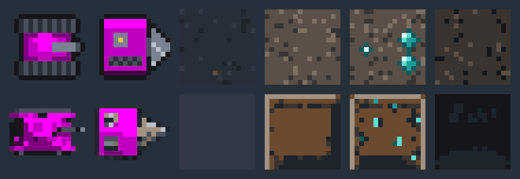
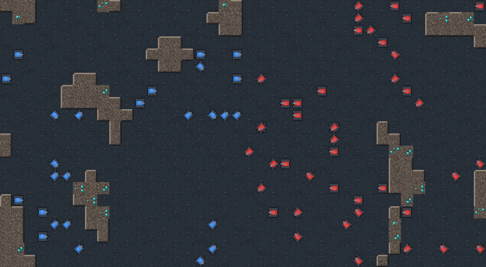
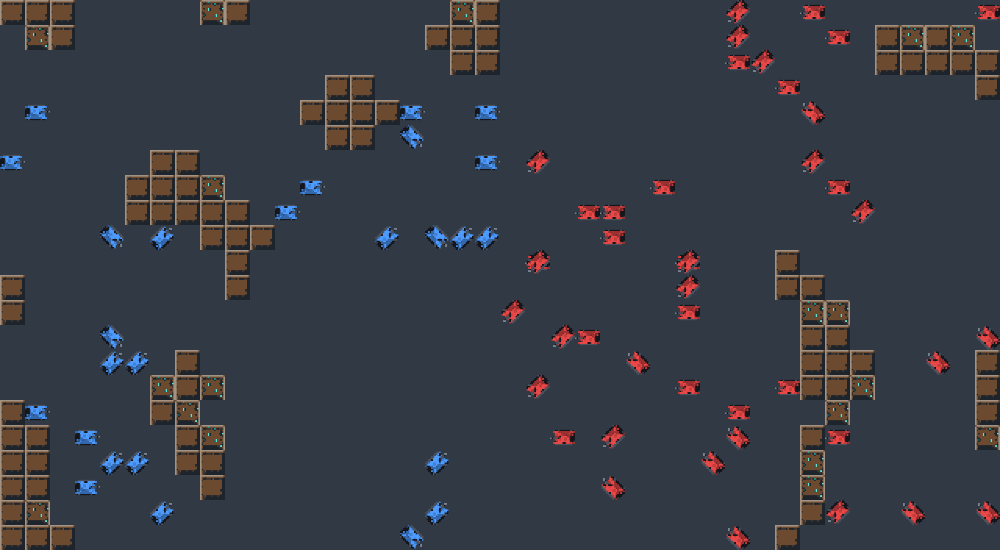

# v0.8 art method prototype

**Decision:** pending (owner gate, plan Task 4). No production art is made until it is recorded here and in the roadmap's decisions log.

The same subjects were made two ways at the provisional 16 px per tile and the same 24-colour palette plus a 4-step magenta team key:

- **(a) Code-generated** (plan Task 2): `Assets/Scripts/Art/Generators/` draws every frame from shapes and seeded noise; `WAR-2D/Art/Generate prototypes` writes `Assets/Art/Prototype/a/`.
- **(b) AI image tool plus clean-up** (plan Task 3): Figma `generate_image` (gemini-3.1-flash-image), cleaned to size and palette by `PaletteQuantizer` (`WAR-2D/Art/Clean AI prototypes`) into `Assets/Art/Prototype/b/`. Raw output and prompts are in `b/raw/`, logged in [ai-content.md](ai-content.md).

## Side by side

Sprites at 8× (top row (a), bottom row (b)): Tank, Miner, floor, rock, gem rock, border.

In context: a 40×22-tile region of a real generated map (256², seed 5, near clearing 2) at the game's default zoom (orthographic size 10 at 1080p is about 3.4 screen pixels per art pixel; shown at 3×), with 70 tanks in player colours 1 and 2. Method (b) has one facing, so its tank is rotated with nearest-neighbour sampling, as the game rotates unit quads today. The mock is composed in the editor from the generated sprites: the game's renderer can't draw either set until the atlases (Task 6) and the unit shader (Task 7) exist.

**(a)** ([1×](method/a-1x.png)):

**(b)** ([1×](method/b-1x.png)):

## Comparison

| | (a) Code-generated | (b) AI tool + clean-up |
|---|---|---|
| **Look** | Clean, readable silhouettes at 16 px; consistent outline and shading; plain, "programmer art" level of detail | Richer detail in the 1024 px source, but most of it is lost at 16 px: the tank's turret and the Miner's vents turn to noise after quantizing |
| **Consistency between assets** | Guaranteed: one palette, one outline rule, one light direction, all in code | Varies per prompt and per call (the terrain came back with framed tiles; proportions differ between subjects); each asset needs a separate check |
| **Directions and animation** | Free: 8 facings × 4 frames from one generator (rotation is computed, then sampled on the pixel grid) | Each facing and frame is another call, and the model doesn't keep the design identical between calls; rotating one facing breaks the pixel grid (see the diagonal tanks) |
| **Autotiling** | 16 rock masks generated from one rule; caves read as smooth shapes | One tile per kind; the rock repeats as visible boxes. 16 consistent masks would need many calls or hand fixing |
| **Effort per new sprite** | Writing a generator (an hour or two for a unit; reusable helpers make it faster) | A prompt (minutes), then clean-up and fixes; cheap for one still image, expensive for a consistent animated set |
| **Determinism** | Byte-identical output from the seed; art is reviewable as code | Not reproducible: the raw output is the source and must be kept |
| **Licensing and disclosure** | Ours, no disclosure | Must be declared in Steam's content survey (logged in `ai-content.md`); terms depend on the tool |
| **Cost** | None | Figma AI credits per call |

## Recommendation

**(a) for everything**, with AI images used at most as private reference while designing a generator (not shipped, nothing to disclose). The deciding factors are the 8-facing animated units the renderer needs, the autotiled terrain, and the v0.7 kit's matching set (Builder, Digger, walls, bomb); (b) is weakest exactly there. The cost is a plainer look, which the style guide (Task 5) can push with palette, shading and outline choices.

A mix is possible if the plainer look is a concern: (a) for units, tiles, effects and icons, and (b) only for large stills such as the HQ (48 px) and any menu art, where the downscale loses less. It brings the disclosure and consistency costs above for those assets.
