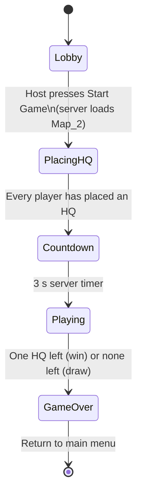

# Gameplay Guide

This document describes how WAR-2D plays **as currently implemented**. Numbers come from `Assets/Resources/GameConfig.xml` unless noted. Where the code doesn't actually use the config value, both are shown. See [known-issues.md](known-issues.md#config-and-balance-mismatches) for details.

## The goal

WAR-2D is a free-for-all RTS for any number of players. Every player has one **Headquarters (HQ)**. If your HQ is destroyed, you're eliminated. The last player with an HQ wins. If every remaining HQ is destroyed in the same check, the match is a draw.

## Match flow

1. **Lobby** (`Main_Menu` scene). Players host or join by IP. Each player can edit their own nickname. The first player to connect (normally the host) is the *server owner* and is the only one who can start the game.
2. **PlacingHQ** (`Map_2`). An HQ placement prompt is shown. Each player places a single 3×3 HQ on open ground. The screen shows how many players are still placing.
3. **Countdown.** When the last HQ is placed, the server waits 3 seconds and then switches to *Playing*. The client UI shows its own 5-second countdown.
4. **Playing.** Economy, building, spawning and combat run, and win/loss is checked every second.
5. **GameOver.** Each player sees a Win or Lose screen with buttons to return to the main menu or quit.

Before *Playing*, the economy and the win/loss checks are paused. Passive income only starts in *Playing*.

## Controls

| Input | Action |
|---|---|
| `W A S D` / arrow keys | Pan the camera |
| Mouse wheel | Zoom (pan speed scales with zoom) |
| Hold `Shift` | Faster pan |
| Left-click + drag | Draw a selection box |
| Right-click | Order all **your** units inside the last selection box to move to the cursor |
| Building button (HUD) | Pick a building; a preview follows the cursor |
| `R` (while placing) | Rotate the building preview 90° |
| Left-click (while placing) | Place the building. The preview is grey if valid and red if not. |
| Left-click on your Small Unit Spawner | Queue one Tank |
| `` ` `` (backquote) | Toggle the developer console |

Camera settings (speed, zoom range, shift multiplier) are in `Assets/Character_Settings.asset`.

## Map and tiles

The map is a grid of 1×1 tiles built from two Unity Tilemaps in `Map_2`:

| Tile | Walkable | Buildable | Notes |
|---|---|---|---|
| Ground (floor) | Yes | Yes | |
| Wall | No | No | |
| Gem | No | No | Miners must face a gem tile to produce resources |

A building occupies tiles based on its sprite size. The HQ is always 3×3. Occupied tiles can't be built on again.

## Economy

There is one resource (shown as **Resources** in the HUD).

| Source / sink | Rate | Notes |
|---|---|---|
| Starting resources | **1000** | Per player |
| Passive income | **5 / second** | Every player, during *Playing* |
| Miner income | **10 / second** per active miner | Only while the miner faces a gem tile |
| Building upkeep | Per building, per second | See table below |
| Unit upkeep | Per unit, per second | See table below |

Upkeep is charged once per second. **If you can't afford an upkeep payment, it is skipped.** Nothing is destroyed and resources never go negative.

## Buildings

Buildings are placed from the HUD. They can be rotated in 90° steps and must sit entirely on free ground tiles.

| Building | Health | Upfront cost (config → actual) | Upkeep / s (config → actual) | Function |
|---|---|---|---|---|
| **Base (HQ)** | 500 | 0 → **100** | 0 → **0** | Your life. One per player, placed during *PlacingHQ*. |
| **Miner** | 50 | 50 → **100** | 0 → **5** | Produces 10 resources/s while the tile it faces is a gem. It can only be placed facing a gem. |
| **Small Unit Spawner** | 300 | 200 → **100** | 20 → **5** | Click it to queue Tanks. It spawns one per frame while the queue has items and you can afford them. |

*"Actual" is what the code charges today, because building costs are read from a fallback loader rather than `GameConfig.xml`.*

### Miner facing

A Miner checks the single tile next to it in the direction it faces:

| Rotation | Checks the tile to the… |
|---|---|
| 0° | right (+x) |
| 90° | up (+y) |
| 180° | left (−x) |
| 270° | down (−y) |

## Units

| Unit | Health | Damage | Range | Attack interval | Speed | Upfront cost | Upkeep / s |
|---|---|---|---|---|---|---|---|
| **Tank** | 100 | 10 | 5 tiles | 1 s | 5 | 50 | 2 |

Range, attack interval and acceleration (5) are hard-coded in `SpawnerSystem`. The others come from `GameConfig.xml`.

- Units spawn at the spawner's position.
- When ordered to move, each unit gets its own nearby free goal tile, so a group spreads out instead of stacking. It then follows an A* path across walkable tiles. Diagonal moves are allowed.

## Combat

- Combat is fully automatic. Every unit picks the **nearest enemy** with health, which can be a unit **or a building**, within range.
- It keeps attacking that target every attack interval while the target is alive and in range. When the target dies or leaves range, it picks a new one.
- Buildings don't attack.
- Anything at 0 health is removed.
- Clients see a short yellow tracer for each attack, a health bar, and a red flash when something takes damage.

## Win, loss and leaving

- During *Playing* the server checks every second which players still own an HQ.
- A player with no HQ is **eliminated** and sees the Lose screen.
- If exactly one player still has an HQ and the match had more than one player, that player **wins**. Everyone else sees the Lose screen.
- If nobody has an HQ, it's a **draw**, and everyone sees the Lose screen.
- When a player disconnects, they're marked eliminated and all their units and buildings are destroyed.
- If the **server owner** (normally the host) leaves, the server shuts down and everyone returns to the main menu.
