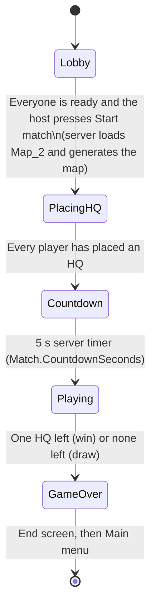

# Gameplay Guide

This document describes how WAR-2D plays **as currently implemented**. Every number comes from `Assets/Resources/GameConfig.xml`, which since v0.2 is the single source of gameplay balance values. The file is parsed strictly (typed, invariant culture); if it is missing or invalid, no server starts.

## The goal

WAR-2D is an RTS for any number of players, free-for-all or in teams. Every player has one **Headquarters (HQ)**. If your HQ is destroyed, you're eliminated. The last **team** with an HQ wins (in free-for-all every player is their own team). If every remaining HQ is destroyed in the same check, the match is a draw.

## Match flow

1. **Main menu → Play → Lobby** (`Main_Menu` scene). The main menu (Play, Settings, Quit) has a live battle running behind it (`<MenuBattle>`; off in Settings → Graphics). **Play** asks for a nickname (remembered) and either **Host** (others join on your IP, port 7778) or **Join** an address (invalid addresses are flagged; while connecting there is a Cancel; a failed join says so). A lobby holds up to **8 players**, and nobody can join once the match has started (the server refuses the connection and the Play screen says why). In the **lobby** every player picks an unused colour (8, from the palette; the host can't pick one yet, see [known-issues.md](known-issues.md)) and readies up; in Teams mode they pick Team 1–4 or Solo (the host can also cycle anyone's team). The host (the server owner: the host, or the next player if the host leaves) sets the **match settings**: mode (Free-for-all or Teams), Diplomacy on/off, map size (`Lobby/MapSizes`: 256, 512, 1024) and starting resources (`Lobby/StartingResources`: 500–5000), the map seed (typed, or **Reroll**). Everyone sees the settings and a **map preview** with the 8 HQ areas (coloured for the players). Any settings change or reroll clears everyone's ready. **Start match** needs every player ready and at least two teams (so someone attacks someone). Teams are fixed when the match starts.
2. **PlacingHQ** (`Map_2`). The map is generated from a seed (see "Map and tiles"). An HQ placement prompt is shown. Each player places a single 3×3 HQ on free ground, in any 90° rotation. The screen shows how many players are still placing.
3. **Countdown.** When the last HQ is placed, the server starts a **5-second** countdown (`Match.CountdownSeconds`) and every client displays the same remaining time from the synced end time.
4. **Playing.** Economy, building, spawning and combat run, and win/loss is checked every second.
5. **GameOver.** Each player sees the **end screen**: Victory, Defeat or Draw, who won and how long it took, and every player's statistics (units built, lost and killed, buildings built and lost, mined, spent, gifted out and in, peak army). Statistics are sent only once the match is over. A player eliminated earlier sees Defeat at once and the table when the match ends. Buttons: Main menu, Quit.

Before *Playing*, the economy, spawning, combat and win/loss checks are paused, and units can't be ordered. Passive income only starts in *Playing*.

## Controls

| Input | Action |
|---|---|
| Arrow keys | Pan the camera (`A`, `S` and `H` are order keys since v0.6) |
| Pointer at a screen edge | Pan that way (Settings → Controls → Edge scrolling) |
| Middle mouse + drag | Drag the map |
| Mouse wheel | Zoom towards the cursor (orthographic size 3–30; 1.5 per notch; pan speed scales with zoom) |
| Double-click a unit | Select every own unit of that type on screen |
| `1`–`0` twice quickly | Select that squad and centre the camera on it |
| `Esc` | In-match menu (closes the settings, gift or diplomacy panel first) |
| Hold `Shift` | Pan 2.5× faster |
| Left-click + drag | Select **every** one of your units inside the box (no limit). A plain click selects what is under the cursor. |
| `Shift` + drag | Add the units in the box to the selection |
| Right-click | Order the selected units to **Move** to the cursor (they ignore enemies until they arrive) |
| `A`, then left- or right-click | **Attack-move** to the cursor: move, but stop to fight enemies in range |
| `Shift` + right-click (or attack-move click) | **Queue** the order after the current one: up to 4 waypoints per unit (`Orders/MaxQueued`). Units without an order start it at once. Stop, Hold or an unqueued order clears the queue. |
| `S` | **Stop**: drop the order and stand (still fighting enemies in range) |
| `H` | **Hold**: stand still, never pushed aside, fighting enemies in range |
| `Ctrl` + `1`–`0` | Assign the selection to squad 1–10 (squads are kept by the server); with nothing selected, empty that squad |
| `1`–`0`, or a squad on the squad bar | Select that squad (a right-click then orders the whole squad at once). The squad bar shows each squad's live unit count. |
| Command card: Move, Attack-move | Arm the order: the next left- or right-click sends it (the armed button is highlighted) |
| Command card: Stop, Hold | Same as `S` and `H` |
| Selection panel: a unit type | Keep only that type selected |
| Command card: Miner, Spawner | Pick a building (greyed out until you can afford it); a preview follows the cursor. Right-click cancels. |
| Minimap: left-click or drag | Move the camera there |
| Minimap: right-click | Send the selection there (Move, or the armed Attack-move; `Shift` queues) |
| `R` (while placing) | Rotate the building preview 90° |
| Left-click (while placing) | Place the building. The preview is grey if valid and red if not. During HQ placement the HQ preview appears on its own. |
| Left-click on your Small Unit Spawner (where none of your units are) | Select it: the command card shows its production queue, where `+` queues one Tank and `−` removes one (max 100 queued; nothing is refunded, as the cost is charged at spawn) |
| `` ` `` (backquote) | Toggle the developer console |

In **Settings → Controls** you can rebind Select, Move, Attack-move, Stop, Hold, Queue order (Shift), the squad-assign modifier (Ctrl), Rotate and Menu: click a binding, press the new key (Esc cancels). A key already in use offers to swap the two bindings. Bindings are saved with the settings. Panning (arrows), the squad number keys, zoom, middle-drag and Shift for fast panning and adding to a box selection are fixed.

## Settings

Settings (main menu, or the in-match menu) apply at once and are saved on this machine (`settings.json` in the player's data folder):

- **Graphics:** resolution (1280×720, 1920×1080, 2560×1440), fullscreen, VSync, FPS cap (60, 120, 144, none), the battle behind the main menu, and the **colour palette**: Standard, Colourblind (Okabe–Ito; every pair at least ΔE2000 20 apart) or High contrast (every player colour at least 4.5:1 against the map floor). The palette recolours units, buildings, the minimap and the whole UI at once.
- **Audio:** master, music and sound-effect volumes (the `Main` mixer's groups).
- **Controls:** rebinding and edge scrolling.
- **Reset to defaults** restores everything, bindings included.

Camera settings (speed, zoom step and range, shift multiplier) are in `Assets/Character_Settings.asset`.

## Map and tiles

The map is a grid of 1×1 tiles. By default it is **generated from a seed** at the start of each match (`Match/Map`): a 1024×1024 cave map with eight HQ clearings on a circle, joined to the centre by corridors, with gem veins on rock facing open floor and a guaranteed vein beside every clearing. `Seed` 0 picks a new seed every match; every client regenerates the same map and checks it against the server. With `Size` 0 the game uses the small hand-built tilemaps in `Map_2` instead.

| Tile | Walkable | Buildable | Notes |
|---|---|---|---|
| Ground (floor) | Yes | Yes | |
| Wall | No | No | |
| Gem | No | No | Miners must face a gem tile to produce resources |
| Border | No | No | The map's outer ring |

A building occupies tiles based on its configured size (3×3 for the HQ, 2×2 for a Small Unit Spawner, 1×1 for a Miner). A building can only be placed when every tile of its footprint is free ground; units standing there are moved to the nearest free tile. Occupied tiles can't be built on again, and units path around buildings.

## Economy

There is one resource (shown as **Resources** in the HUD).

| Source / sink | Rate | Notes |
|---|---|---|
| Starting resources | **1000** | Per player |
| Passive income | **5 / second** | Players still in the match, during *Playing* only |
| Miner income | **10 / second** per active miner | Only while the miner faces a gem tile |
| Building upkeep | Per building, per second | See table below |
| Unit upkeep | Per unit, per second | See table below |

Upkeep is charged once per second. Units are charged one by one (oldest slot first) until the owner's resources run out; the rest go unpaid. **If a player can't afford an entity's upkeep, that entity decays**: it loses `DecayPercentPerSecond` of its **max** health every second (5% by default) until its owner can pay. Decay can destroy the entity. Resources never go negative.

## Buildings

Buildings are placed from the HUD, can be rotated in 90° steps, and must sit entirely on free ground. Except for the HQ, they can only be placed during *Playing*; the HQ can only be placed during *PlacingHQ*, one per player.

| Building | Size | Health | Upfront cost | Upkeep / s | Function |
|---|---|---|---|---|---|
| **Base (HQ)** | 3×3 | 500 | 0 | 0 | Your life. Placed during *PlacingHQ*. |
| **Miner** | 1×1 | 50 | 50 | 0 | Produces 10 resources/s while the tile it faces is a gem. Placement is only allowed when it faces a gem. |
| **Small Unit Spawner** | 2×2 | 300 | 200 | 20 | Click it to queue Tanks (up to 100 queued). Produces **1 unit per second** (`SpawnRate`), charging each Tank's cost as it spawns. |

### Miner facing

A Miner checks the single tile next to it in the direction it faces:

| Rotation | Checks the tile to the… |
|---|---|
| 0° | right (+x) |
| 90° | up (+y) |
| 180° | left (−x) |
| 270° | down (−y) |

## Units

| Unit | Health | Damage | Range | Attack interval | Speed | Acceleration | Upfront cost | Upkeep / s |
|---|---|---|---|---|---|---|---|---|
| **Tank** | 100 | 10 | 5 tiles | 1 s | 5 | 5 | 50 | 2 |

- A player can own at most **10,000 units** (`Simulation/MaxUnitsPerPlayer`). A spawner at the cap keeps its queue and refunds the unit.
- A spawner creates a unit on the nearest free walkable tile outside its footprint. Units are round bodies (`Radius` 0.35 tiles for the Tank) that push apart when they overlap, so a crowd spreads out on its own.
- A move order gives the whole group one shared flow field to the goal, so any number of units path around walls and buildings together. The group gathers around the goal and stops within a radius that grows with its size.
- Every unit has a stance. On a **Move** order it ignores enemies until it arrives. On an **Attack-move** order, an enemy in range makes it stop to fight, and it resumes the order when the target is gone. **Idle** (no order, or arrived) and **Hold** units fight whatever comes in range; a Hold unit never moves, not even when its neighbours push. Arriving at the goal makes a Move or Attack-move unit Idle.

## Fog of war, teams and diplomacy

- Each player sees through the eyes of all their units and buildings, plus those of every player sharing vision with them. Teammates share vision with each other from the start. Sight radius (`Sight`) is per unit and building type in `GameConfig.xml`: Tank 8 tiles, HQ 10, Spawner 6, Miner 4.
- Walls block sight; you can see a wall's face but not what's behind it. Fog is tracked on a grid of 2×2-tile cells and updated 5 times a second.
- The map shows three states: **unexplored** (black), **explored** (dimmed: you've seen it before), and **visible** (clear).
- You only receive other players' units standing where you can see now (your own sight plus vision shared with you). Enemy buildings you've seen stay on your map as dimmed **last-seen ghosts** when they go out of sight; you only find out a ghost was destroyed when you see its spot again.
- Diplomacy is per player and one-way. At the start, teammates don't attack each other and share vision; everyone else attacks and doesn't share. When the match has diplomacy on, each player chooses whom they attack and with whom they share vision (at most one change per command every 2 s, `Diplomacy/ChangeCooldownSeconds`). Stopping sharing keeps what the other player already explored. Nobody learns another player's choices, except that you're told who shares vision with you. Units of players who don't attack each other never damage each other (bomb blasts will be the exception, v0.7). The **Diplomacy** button on the top bar (shown only when the match has diplomacy on) opens a panel with an Attack and a Share-vision switch per player; it also marks who shares vision with you.

### Alerts

The alert feed (top left) shows the newest four alerts for 8 s each (`Alerts/ShowSeconds`); × dismisses one. You're told only about your own things and choices made towards you:

- **Under attack near your HQ/Spawner/Miner** (or "Your units are under attack"): one of your units or buildings took damage. The minimap pings the spot. At most one per 32-tile area every 10 s (`Alerts/AreaTiles`, `Alerts/ThrottleSeconds`). It never says who attacked.
- **Upkeep unpaid**: some of your upkeep first went unpaid (repeats only after a fully paid second).
- **A player shares vision with you / stopped sharing vision with you**.
- **A player gifted you N** (gifting arrives with the in-match menu).

## Combat

- Combat is fully automatic. Every unit picks the **nearest enemy unit** (a unit of any player its owner attacks) within range, and only when there is none, the nearest enemy **building**. Idle units look for targets every few ticks, so a new enemy is picked up within about 0.4 s.
- Damage is the attacker's `Damage` times a multiplier from the damage table (`DamageTable`) for what it hits: units, buildings or walls. Every Tank multiplier is 1.0 except walls (0.5, used once walls arrive in v0.7).
- It keeps attacking that target every attack interval while the target is alive and in range. When the target dies or leaves range, it picks a new one.
- Buildings don't attack.
- Anything at 0 health is destroyed, and **every death plays an explosion**. The server sends each player only the deaths inside their camera view that they can see (their sight plus vision shared with them), at most 1,024 a tick; once the match is over, the end-of-match wipe shows wherever they look.
- Clients see a short yellow tracer for each attack whose attacker is on screen, and a health bar over every damaged unit or building.

## Win, loss and leaving

- During *Playing* the server checks every second which players still own an HQ.
- A player with no HQ is **eliminated**: all their remaining units and buildings are destroyed (each with an explosion) and they see the Lose screen. Eliminated players stop earning passive income.
- If no player with an HQ left attacks another (they are all at peace with each other, or only one is left), and the match started with more than one team, they **win** together: every HQ holder, and every eliminated player whose starting team includes one, sees the Win screen. Peace must be mutual: if one survivor still attacks another, the match goes on. Everyone else sees the Lose screen, and the winner's world is wiped with explosions as the match ends.
- If nobody has an HQ, it's a **draw**, and everyone sees a Draw screen.
- **Esc** (or Menu on the top bar) opens the **in-match menu**: Resume, Settings, Surrender and Leave match. Nothing pauses. **Surrender** asks to confirm, then eliminates you exactly as losing your HQ.
- **Gifting.** Gift (top bar) sends resources to any other live player, ally or enemy (marked from whom you attack): an amount from 1 up to what you have, one gift every 5 s (`Gifting/CooldownSeconds`). It is taken from you and given at once; only you and the recipient are told (the recipient gets an alert).
- When a player disconnects mid-match, they're removed from the player list, their units and buildings are destroyed, and the lobby UI updates. If the **server owner** leaves, ownership passes to another player; if the host itself leaves, the server shuts down and everyone returns to the main menu.
