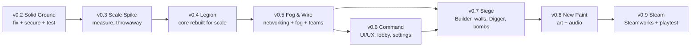

# WAR-2D Roadmap: v0.2 to v0.9

This is the overarching development plan for WAR-2D. It explains **what** each update delivers, **why** it comes in that order, and **how we know it's done**.

- **Design source of truth:** [roadmap design spec](superpowers/specs/2026-10-05-war2d-roadmap-design.md). This document summarises and explains it. If the two ever disagree, the spec wins and this file gets fixed.
- **Step-by-step plans:** each update gets its own implementation plan in [`docs/superpowers/plans/`](superpowers/plans/), written when that update starts.
- **Current state of the game:** [gameplay.md](gameplay.md), [architecture.md](architecture.md), [known-issues.md](known-issues.md).

| Update | Name | Status | Detailed plan |
|---|---|---|---|
| v0.2 | Solid Ground | **In progress:** tasks 1–13 of 17 done (branch `release/v0.2`); URP 2D, match tests, Windows profile and release remain | [2026-10-05-v0.2-solid-ground.md](superpowers/plans/2026-10-05-v0.2-solid-ground.md) |
| v0.3 | Scale Spike | Not started | Written when v0.2 ships |
| v0.4 | Legion | Not started | Written after v0.3 results |
| v0.5 | Fog & Wire | Not started | — |
| v0.6 | Command | Not started | — |
| v0.7 | Siege | Not started | — |
| v0.8 | New Paint | Not started | — |
| v0.9 | Steam | Not started | — |

---

## 1. Where we're going

WAR-2D is a pixel-art 2D real-time strategy game for **Steam on Linux and Windows**. What makes it different is **army scale**: each player can control **10,000 active units**. Matches have up to **8 players**, so up to **80,000 units** on one map, in **free-for-all or team** modes.

Two promises shape every technical decision:

1. **Scale:** 10,000 units per player must run smoothly on an ordinary gaming PC that is both hosting and playing.
2. **Security:** no player's computer ever receives information their team isn't allowed to know. Hidden bombs stay hidden and fog of war can't be cheated. Every message a client sends is checked by the server.

New gameplay on the way:
- **Builder units** that construct everything except the HQ
- **buildable walls**
- **Digger** siege units that tunnel through rock and walls
- **hidden bombs** only the owning team can see

Alongside these come a full UI/UX overhaul, a consistent pixel-art and chiptune audio set, and Steam integration.

### Starting point (v0.1)

Today the game is a working networked prototype. Players host or join by IP, place an HQ, mine gems, build spawners and fight with Tanks until one HQ is left. It's built on Mirror networking and Unity DOTS. The code review in October 2026 found about 30 bugs, mismatches and hygiene problems ([known-issues.md](known-issues.md)). The current design also can't scale anywhere near 10,000 units. Each player's visible list is rebuilt every server tick, every unit runs its own A* search, combat compares every unit against every possible target, and every unit is drawn as its own GameObject.

---

## 2. Why this order

We chose **foundation first, then prove scale, then features**. Two alternatives were rejected:

- **Features first, scale later.** Walls, bombs and Diggers built on today's code would mostly be thrown away when the core is rebuilt for 80,000 units.
- **One big rewrite.** Months without a playable build, and one huge risky change, which works against "as bug-free as possible".

The order follows from the dependencies:
- **v0.2 first:** you can't build reliably on a buggy, untested base.
- **v0.3 before v0.4:** the riskiest assumptions (line-of-sight fog at 80,000 units, network bandwidth, rendering) get measured cheaply before the core is rebuilt around them.
- **v0.5 before v0.6 and v0.7:** the HUD minimap, team lobby and hidden bombs all depend on teams, fog of war and the new networking.
- **v0.8 late:** art is easiest to replace once the systems that display it (instanced rendering, UI Toolkit) exist.
- **v0.9 last:** Steam integration wraps a finished game.

Every update **except v0.3** ships a playable, tested build.

---

## 3. The updates

Each update below lists its goal, its scope, the key decisions already made, what's still open, and its exit criteria. All gameplay numbers are **starting values in `GameConfig.xml`**, meant to be tuned.

### v0.2: Solid Ground

> Make the existing game correct, secure and tested before anything new is built on it.

**Why now:** every later update builds on this code. Fixing the known bugs now is cheaper than working around them in six more updates, and the test suite created here protects everything that follows.

**Scope**
- **Fix everything in [known-issues.md](known-issues.md)**, plus two bugs found while planning: a path-finding memory leak, and units spawning trapped inside their spawner. The only exception is one performance item that v0.5 replaces anyway.
- **One config file.** `GameConfig.xml` becomes the single, strictly validated source of every number. Today building costs secretly ignore it.
- **Security.** Every client command is rate-limited and validated on the server (ownership, game state, value ranges). Nicknames are sanitised. Clients that abuse rate limits are disconnected.
- **Rules decided with the owner:**
  - Units and buildings whose upkeep can't be paid **decay** (lose health each second) until it's paid.
  - Spawners honour `SpawnRate`.
  - When a player is eliminated or leaves, **all their units and buildings are destroyed, each with an explosion**.
  - Every death plays an explosion, and the server only sends each player the explosions inside their view.
- **Match flow:**
  - one server-owned countdown
  - dedicated servers can start matches
  - leaving players are cleaned up properly
  - draws show a Draw screen
  - the match scene comes from config
- **Technology:**
  - URP 2D instead of the leftover HDRP settings
  - the new Input System only
  - an orthographic camera
  - unused packages removed
- **Testing:** game code moves into its own assembly, plus edit-mode and play-mode test suites that run through the live editor (`tools/unity-test.sh`). Rule tests, fuzz tests on input validation, and hosted full-match tests.
- **Housekeeping:** legacy and work-in-progress code deleted, menu wiring made explicit, Windows build profile added (with owner approval to download the module).

**Exit criteria**
- `known-issues.md` is empty, apart from items deliberately scheduled for later versions.
- All tests pass.
- A full 2-player match plays start to finish on **Linux**. Windows verification is deferred to a later update.

**Detailed plan:** [v0.2 implementation plan](superpowers/plans/2026-10-05-v0.2-solid-ground.md), 17 tasks.

---

### v0.3: Scale Spike *(internal prototype, thrown away)*

> Measure whether the techniques chosen for 80,000 units actually work, before the core is rebuilt around them.

**Why now:** v0.4 commits the whole game to an architecture. If line-of-sight fog or bandwidth turns out to be too expensive, it's far cheaper to learn that in a throwaway prototype.

**Scope:** a separate test scene that measures, on the reference machine:

| Technique | Question it answers |
|---|---|
| 80,000-unit simulation as parallel Burst jobs | Can one server tick finish in ≤ 25 ms? |
| Flow fields (shared pathfinding per order) | How fast are fields built and partly rebuilt when terrain changes? |
| Spatial-hash combat | Does nearest-enemy search stay cheap at this density? |
| Team line-of-sight fog (symmetric shadowcasting) | Can 5 updates per second fit in the budget, with vision sources merged? |
| GPU-instanced sprite rendering | Can a client show 10,000 own units at ≥ 60 fps? |
| Path-plus-correction networking with 8 simulated clients | Is the average under 128 KB/s per client? |

**Output:** measured numbers and a go/no-go decision for each technique, written into the spec's results table (§4.6). Fallbacks are already listed: lower update rates, coarser grids, radius-only vision for units, or recommending dedicated servers for 8-player matches.

**Exit criteria:** every row has a measurement and a decision. v0.4 doesn't start until this is complete. The prototype code is **not** merged into the game.

---

### v0.4: Legion

> Rebuild the core so 10,000 units per player run smoothly.

**Why now:** this is the game's defining feature, and everything after it (fog, UI for huge armies, siege units) assumes it.

**Scope** (adjusted by the v0.3 results)
- **Fixed-tick simulation.** Gameplay runs at 20 ticks per second as parallel Burst jobs. Client commands are queued and applied at tick boundaries, never inside network callbacks.
- **The tile map moves into ECS** as a flat array, so jobs can read it directly.
- **Flow-field pathfinding.** One shared field per move order, cached, split into 32×32 sectors so terrain changes only rebuild what they touch. Simple separation steering stops units stacking.
- **Spatial hash.** A bucket grid rebuilt every tick, used for target search, separation, and later bomb triggers and blasts.
- **Combat.** Target searches are spread across ticks. A **damage table** in `GameConfig.xml` sets a multiplier per attacker type against each kind of target (unit, building, wall).
- **Stable network IDs** made of an index plus a reuse counter.
- **Instanced rendering.** Units are drawn with GPU instancing from a sprite atlas: one draw call per atlas, not one GameObject per unit.
- **Control.** **Unlimited box select** and **squads** stored on the server, bound to keys 1–0.

**Exit criteria:** 10,000 units per player meet the performance budget (§4) on a local host.

**Open decisions (made at the start of v0.4, informed by v0.3):** whether buildings and walls are instanced or pooled GameObjects, the time-slicing interval for target search, and the separation-steering strength.

---

### v0.5: Fog & Wire

> New networking that scales and keeps secrets, plus real fog of war and teams.

**Why now:** v0.4 makes 80,000 units possible on one machine. v0.5 makes it possible across the network without sending anything a player shouldn't know.

**Scope**
- **Replication (the "hybrid" model).** When a unit gets an order, the server sends its **waypoints, start time and speed once**. The client animates the unit itself. Corrections are only sent when a unit is pushed off course, blocked or fighting. Health changes, spawns, deaths and explosions are compact events. This replaces today's per-player visible lists.
- **What each client receives:** all of its own team's units and structures, plus enemies standing on tiles its team can currently see. **Never:** enemy bombs, enemy resources, or enemy fog data.
- **Fog of war (line of sight).**
  - Each team has a visibility grid and an explored-memory grid.
  - Walls and rock block sight.
  - The server is the only authority; clients only receive changes to their own team's grids.
  - Explored terrain is remembered as it was last seen.
- **Teams.** Team membership in the data model. Allies share vision and can't damage each other (bomb blasts are the exception, see v0.7).

**Exit criteria**
- 8 clients × 10,000 units stay within the bandwidth budget.
- **Leak tests** prove no hidden information is ever serialised to a client.

**Why not lockstep?** Deterministic lockstep (sending only commands) scales easily, but every client would know every enemy position, so map-hacks become trivial. It would also need the whole simulation rewritten in fixed-point maths to stay in sync across Linux and Windows. The hybrid model keeps the server authoritative and the secrets safe.

---

### v0.6: Command

> A UI/UX built for commanding thousands of units, plus proper menus, lobby and settings.

**Why now:** the HUD needs fog-aware minimaps, squads and team lobbies, which only exist after v0.4 and v0.5.

**Scope** (UI Toolkit throughout; world-space health bars stay instanced)
- **In-match HUD**
  - **Top bar:** resources with live income and upkeep, player and team list, resource gifting to allies.
  - **Minimap:** respects fog, click to move the camera, right-click to order, alert pings.
  - **Selection panel:** counts per unit type, click a type to filter, combined health.
  - **Command card:** build menu, production queues, Move, Attack-move, Stop, Hold, Dig, Repair.
  - **Squad bar** for keys 1–0.
  - **Alert feed:** under attack, bomb triggered, construction finished, can't afford upkeep.
- **Controls** (all rebindable)
  - Camera: WASD, edge scroll (can be turned off), middle-drag pan, zoom towards the cursor.
  - Selection: Shift adds to the selection, double-click selects that type on screen.
  - Squads: Ctrl+number creates a squad, the number selects it, double-tap centres the camera.
  - Orders: A attack-move, S stop, H hold, Shift queues orders.
  - Building: R rotates, drag places walls, Esc cancels.
- **Menus and lobby**
  - New main menu.
  - Host or join by IP. Steam's server browser replaces this in v0.9.
  - Lobby: nickname, team, colour, ready-up. The host picks FFA or teams, the map and the starting resources.
  - In-match menu: settings, leave, surrender. Nothing pauses in multiplayer.
  - End screen with match stats.
- **Settings**
  - Graphics, audio volumes, full key rebinding, UI scale.
  - **Colour-blind-safe and high-contrast** team palettes.
- **Resource gifting:** a validated server command plus its UI.

**Out of scope:** the tutorial, which comes later once the game is more complete.

**Exit criteria:** every UI flow has play-mode test coverage, and no debug UI remains in builds.

**Open decisions:** how many maps ship with map selection, and the HUD's exact layout and visual style (the style is finalised with the v0.8 art).

---

### v0.7: Siege

> The new gameplay: Builders, walls, Diggers and hidden bombs.

**Why now:** these features need flow fields that update when terrain changes (v0.4), line-of-sight fog and team-only visibility (v0.5), and the command card and alerts (v0.6).

**Builder and construction**
- Builders are produced from the **HQ**. This may change later.
- Placing a building creates a **blueprint**. The full cost is taken at placement and **refunded in full if cancelled before construction starts**.
- Each Builder adds build power, so more Builders build faster. A building under construction has health in proportion to its progress and can be attacked.
- Builders build everything except the HQ. They don't attack.
- **Repair:** Builders repair damaged own or allied buildings and walls over time, for a resource cost.

**Walls**
- Drag to lay a straight line (horizontal, vertical or diagonal) of 1×1 segments. Each segment is its own blueprint.
- They block movement **and line of sight**, have health and can be destroyed. A destroyed wall becomes floor.

**Digger (siege unit)**
- Right-click rock or a wall to dig toward the clicked point, tile by tile.
- Dug tiles become **permanent floor**, opening new attack routes.
- **Gem tiles pay out a lump of resources** when dug, then become floor. Any Miner facing that tile stops producing.
- **Map border tiles can't be dug.**
- It can fight if forced, but the damage table makes it weak against units and strong against buildings and walls.

**Hidden bombs**
- 1×1 traps built by Builders from the build menu.
- **Limited only by cost and upkeep** (no count cap).
- From the moment the blueprint is placed, a bomb is **never sent to enemy clients**. Enemies can still see the Builder working there.
- It explodes when **any enemy unit** enters its tile, damaging **everything** in its blast radius, **including friendly units and buildings**.
- Everyone who can see the tile sees the explosion.
- There is no detection counter in this roadmap.

**Exit criteria:** rules tests for every feature, and leak tests proving bombs never reach enemy clients.

**Open decisions:** all starting numbers (build power, dig time, gem payout, blast radius and damage, bomb and wall costs and upkeep, repair rate and cost).

---

### v0.8: New Paint

> Replace every placeholder with a consistent pixel-art set, and add sound and music.

**Why now:** the systems that display art (instanced unit rendering, UI Toolkit HUD, fog rendering) exist by now, so the art is made once, to fit them.

**Scope**
1. **Choose the art method by prototype.** Make the same few sprites (one unit, one building, one tile set) two ways:
   - (a) code-generated by Claude, drawn pixel by pixel from scripts in the repo
   - (b) an AI image tool, with Claude handling palette clean-up and packaging

   The owner picks one. *Limitation:* Claude isn't an image-generation model. Code-generated art works well for tiles, icons, UI and small sprites, but gets harder for detailed animated characters.
2. **Style guide:** palette, tile size, **one pixels-per-unit value for all art**, how team colours are applied, frame counts for each animation, UI style.
3. **Pipeline:** sources → import script (palette mapping, team-colour masks, atlas packing, Unity import settings) → owner review before merge.
4. **Pixel Perfect Camera.** Moved here from v0.2, because it needs all art at one pixels-per-unit (today the Base sprite uses 22 and the others 32).
5. **Audio:**
   - sound effects from an **sfxr-style generator script**
   - music from a **code-generated chiptune generator**

   Both scripts are checked into the repo.
6. **Steam disclosure:** AI-generated content is declared in Steam's content survey.

**Exit criteria:** every placeholder art and audio asset is replaced.

---

### v0.9: Steam

> Ship the game to a Steam playtest.

**Scope**
- **Steamworks** integration through the **FizzySteamworks** transport for Mirror.
- **Steam lobbies and invites**, **relay** (no port forwarding), and **authentication tickets** so the server knows who each player really is.
- A **headless dedicated server build** alongside player hosting.
- A **server browser** replacing join-by-IP.
- Store page and content-survey preparation, including the AI-content disclosure.

**Exit criteria:** a friends-only Steam playtest on Linux and Windows. Windows verification happens here at the latest.

**Open decisions:** Steam app setup (app ID, depots), and the friends playtest group.

---

## 4. Performance budget

These are measured from v0.4 on, on the **reference machine**: the owner's dev PC, a Ryzen 5 5600GT (6 cores, 12 threads), 32 GB RAM and a Radeon RX 6600, running Linux, hosting and playing at the same time.

| Metric | Target |
|---|---|
| Server simulation | 20 ticks/s, **≤ 25 ms per tick** at 80,000 units |
| Client frame rate | **≥ 60 fps** with 10,000 own units on screen |
| Bandwidth per client | **≤ 128 KB/s average**, ≤ 256 KB/s peak |
| Host upload with 7 remote players | about 7 Mbps average |

---

## 5. How every update is built

These rules apply to every update. They're the "secure and bug-free as possible" promise in practice.

**Bugs before features**
- Any bug found during an update is fixed in that update, or logged in [known-issues.md](known-issues.md) with a target version.
- Each update starts by clearing the issues targeted at it.

**Security**
- The server is authoritative. Clients only send requests.
- Every client command goes through `CommandGate` (rate limits) and validates its arguments on the server.
- Hidden information never leaves the server, and leak tests prove it from v0.5 on.
- Random and malformed input is fed to every validator (fuzz tests).

**Testing** (run locally through the live Unity editor; there's no CI)
- **Edit-mode tests** for every rule: placement, combat, economy, config, pathfinding, line of sight, validators.
- **Play-mode tests** for full hosted matches.
- **Performance tests** gated on §4 from v0.4 on.
- Run them with `tools/unity-test.sh EditMode` and `tools/unity-test.sh PlayMode`.

**Workflow**
- **Branches:** one branch per update (`release/v0.x`), with a PR per feature into it.
- **Commits:** never include co-author or AI attribution lines (see [CLAUDE.md](../CLAUDE.md)).
- **Editor automation:** scene and asset changes go through the live editor (`unity command ...`), never hand-edited YAML. The editor needs the `com.unity.pipeline` package.
- **Review gate before each merge:** a security review and a code review. Docs, `known-issues.md` and `CLAUDE.md` are updated in the same branch.

**Definition of done for an update**
- All tests pass.
- Performance budget met (from v0.4).
- No open known issue targeted at that version.
- A full match played on Linux. Windows is required from v0.9 at the latest.

---

## 6. Risks and how we handle them

| Risk | Mitigation |
|---|---|
| Line-of-sight fog too slow at 80,000 units | Measured in v0.3. Fallbacks: lower update rate, coarser vision grid, radius-only vision for units with LOS kept for structures |
| Host upload too high for home connections with 8 players | Measured in v0.3. Fallbacks: fewer corrections, coarser quantisation, recommend dedicated servers for 8-player matches |
| Instanced sprite rendering is complex in URP 2D | Prototyped in v0.3 before committing |
| Mirror message size or throughput limits at this scale | Measured in v0.3. Large messages split into chunks. Transport settings tuned in v0.5 and v0.9 |
| Code-generated art hits a quality ceiling | v0.8 starts with a method prototype before committing |
| Scope creep for a two-person team | Each update has fixed scope and exit criteria. New ideas go to a backlog, not into the current update |
| Cloud agent sessions can't verify Unity work | Implementation runs locally, where the editor is connected. Cloud sessions could only write unverified code |

---

## 7. Not in this roadmap

These are deliberately out of scope for v0.2–v0.9 and can be planned afterwards: the tutorial and onboarding, ranked matchmaking, player accounts beyond Steam identity, replays, bomb-detection units, AI opponents, and mobile or console platforms.

---

## 8. Decisions log

The full table is in the spec (§2). The decisions that most shape the roadmap:

| Topic | Decision |
|---|---|
| Unit target | 10,000 per player, up to 8 players (80,000 units) |
| Modes | FFA and teams (2–4 teams) |
| Network model | Server-authoritative hybrid: paths plus corrections |
| Fog of war | Line of sight, per team, explored terrain remembered |
| Hosting and online | Player-hosted and dedicated servers, on Steam |
| Team economy | Separate resources, with gifting to allies |
| Unpaid upkeep | Decay until paid |
| Elimination or leaving | All the player's entities destroyed, with explosions |
| Rendering | URP 2D; Pixel Perfect Camera in v0.8 |
| Art and audio | Pixel art (method chosen in v0.8); sfxr-style SFX; code-generated chiptune music |
| Testing | Local only, through the live editor; no CI |
| Team | The owner plus Claude, in small shippable updates |
